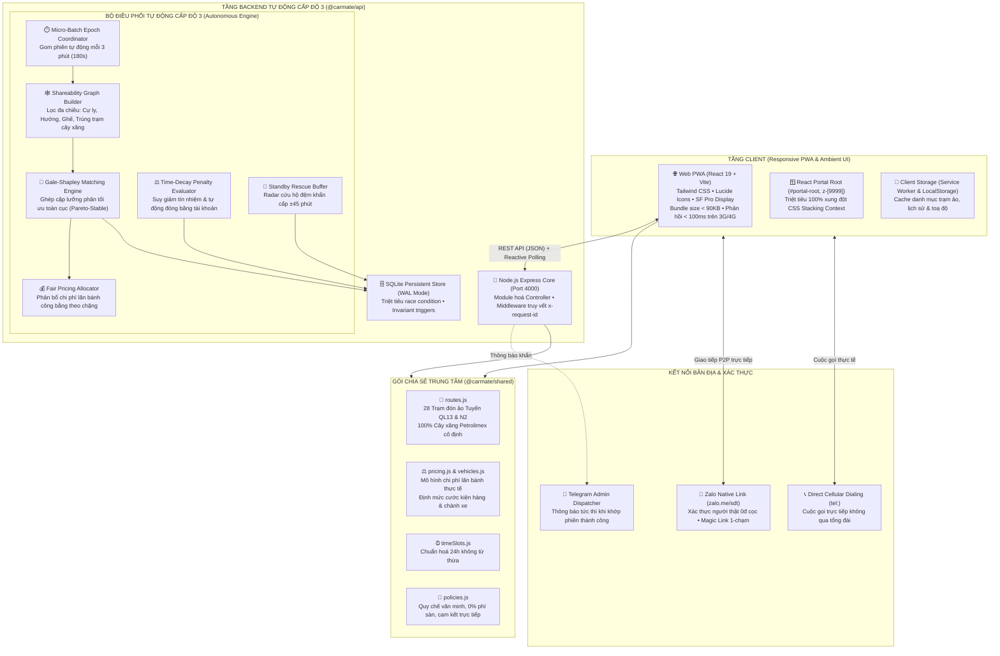
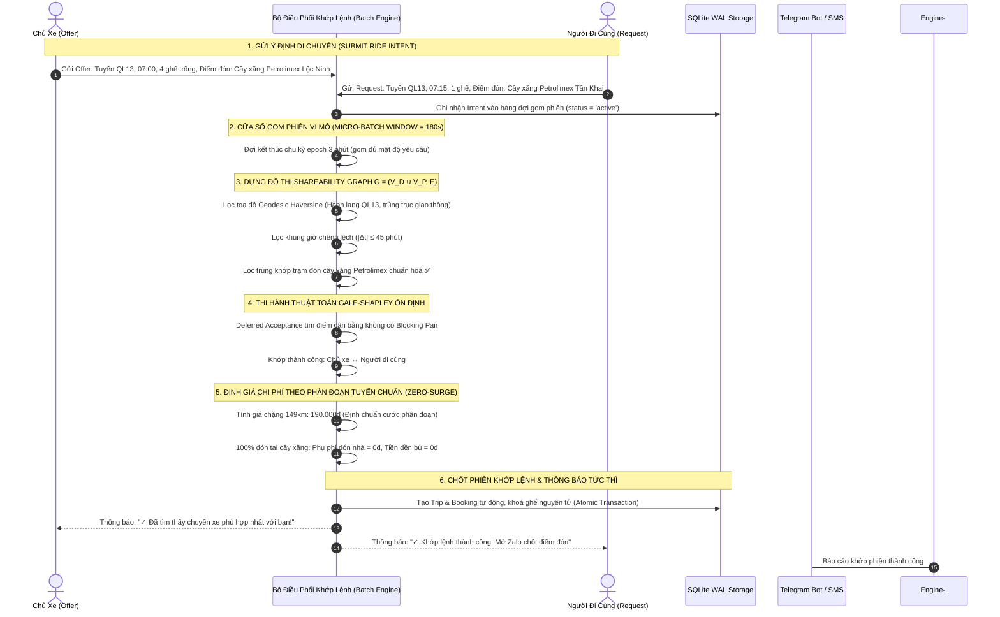
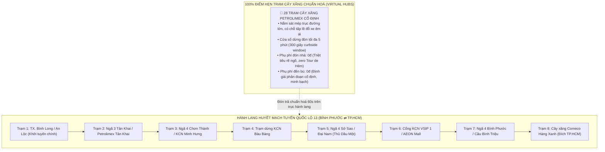
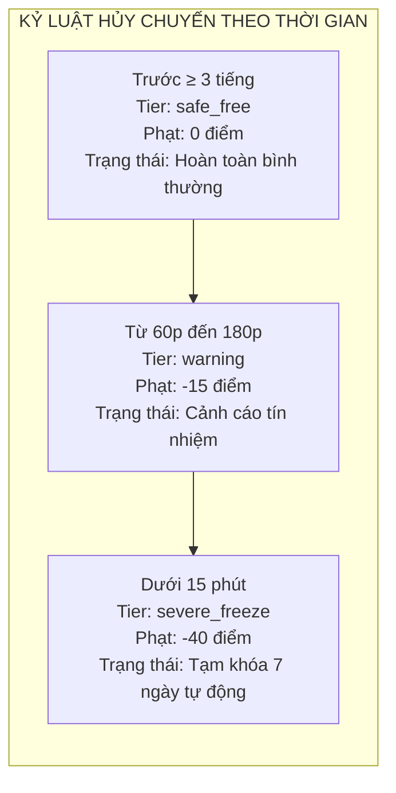
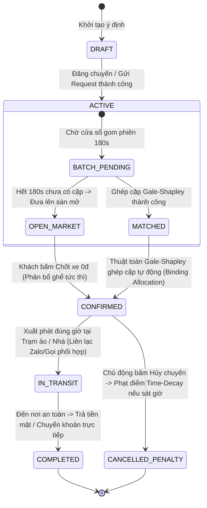
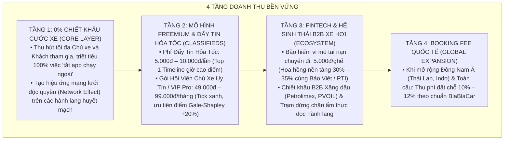

# 🏛️ CarMate — Kiến Trúc Hệ Thống Cấp Độ 3 & Các Công Trình Toán Học Nền Tảng (System Design Architecture & Mathematical Foundations)

> **Tài liệu Thiết kế Kiến trúc Toàn diện & Cơ sở Khoa học (Production-Ready Architecture Whitepaper)**  
> **Phiên bản:** CarMate Autonomous Level 3 (Khớp lệnh tự động & Mạng lưới Trạm đón ảo)  
> **Tuân thủ 4 trụ cột:** **Tư duy MIT (Bất biến Toán học & Logic)** • **Tư duy Stanford (Công thái học & Tải nhận thức = 0)** • **Tư duy Cursor (Ambient Intelligence & Zero Blocking)** • **Thị giác Apple (Liquid Aesthetics & React Portals)**.

---

## MỤC LỤC HỆ THỐNG
1. [Sơ Đồ Kiến Trúc Hệ Thống Cấp Cao (High-Level Architecture)](#1-sơ-đồ-kiến-trúc-hệ-thống-cấp-cao)
2. [Quy Trình Khớp Lệnh Tự Động Cấp Độ 3 (Level 3 Autonomous Engine Pipeline)](#2-quy-trình-khớp-lệnh-tự-động-cấp-độ-3)
3. [Mạng Lưới Điểm Đón Ảo Chuẩn Hóa Dọc Tuyến (100% Virtual Hubs — Triệt Tiêu Đón Tận Nhà)](#3-mạng-lưới-điểm-đón-ảo-chuẩn-hóa-dọc-tuyến)
4. [Các Công Trình & Mô Hình Toán Học Cốt Lõi (Core Mathematical Foundations)](#4-các-công-trình--mô-hình-toán-học-cốt-lõi)
   - [Công trình 1: Phân Phối Chi Phí Công Bằng Shapley Value (Lloyd Shapley, Nobel 2012)](#công-trình-1-phân-phối-chi-phí-công-bằng-shapley-value)
   - [Công trình 2: Đồ Thị Shareability & Thuật Toán Ghép Cặp Gale-Shapley (1962)](#công-trình-2-đồ-thị-shareability--thuật-toán-ghép-cặp-gale-shapley)
   - [Công trình 3: Hình Học Cầu Geodesic Haversine & Hệ Số Uốn Khúc Tuyến Tính](#công-trình-3-hình-học-cầu-geodesic-haversine--hệ-số-uốn-khúc-tuyến-tính)
   - [Công trình 4: Hàm Suy Giảm Thời Gian Phạt Hủy Chuyến (Time-Decay Penalty Engine)](#công-trình-4-hàm-suy-giảm-thời-gian-phạt-hủy-chuyến)
   - [Công trình 5: Bài Toán Tối Ưu Gom Phiên Vi Mô (Micro-Batch DARP Optimization)](#công-trình-5-bài-toán-tối-ưu-gom-phiên-vi-mô)
   - [Công trình 6: Radar Cứu Hộ Đệm Khẩn Cấp (Emergency Standby Buffer)](#công-trình-6-radar-cứu-hộ-đệm-khẩn-cấp)
   - [Công trình 7: Hệ Tọa Độ Stanford Frenet Frame 1D (Werling & Thrun - Stanford Autonomous Driving)](#công-trình-7-hệ-tọa-độ-stanford-frenet-frame-1d)
   - [Công trình 8: Cửa Sổ Radar Động Học Kinematics (Carlos Daganzo, UC Berkeley)](#công-trình-8-cửa-sổ-radar-động-học-kinematics)
   - [Công trình 9: Thuật Toán Xếp Lịch Phân Đoạn Tuyến Tính MIT (Linear Interval Scheduling)](#công-trình-9-thuật-toán-xếp-lịch-phân-đoạn-tuyến-tính-mit)
   - [Công trình 10: Mô Hình Cân Bằng Thương Lượng Nash & Sàn Bù Xăng/BOT Hàng Ngày](#công-trình-10-mô-hình-cân-bằng-thương-lượng-nash--sàn-bù-xăngbot-hàng-ngày)
   - [Công trình 11: Nghiên Cứu An Toàn VTTI & NHTSA (Triệt Tiêu Gọi Điện / Chat Khi Lái Xe)](#công-trình-11-nghiên-cứu-an-toàn-vtti--nhtsa)
   - [Công trình 12: Tối Ưu Dừng Đón Curbside Window 45–60 Giây (Susan Shaheen, UC Berkeley TSRC)](#công-trình-12-tối-ưu-dừng-đón-curbside-window-4560-giây)
   - [Công trình 13: Kiến Trúc An Ninh Bất Đối Xứng (Asymmetric Trust & Fly-By Ghosting Penalty)](#công-trình-13-kiến-trúc-an-ninh-bất-đối-xứng)
   - [Công trình 14: Quy Hoạch Mạng Lưới Tuyến Thưa (Thin) & Đậm Đặc (Dense) Hub-and-Spoke Topology](#công-trình-14-quy-hoạch-mạng-lưới-tuyến-thưa-thin--đậm-đặc-dense)
5. [Hệ Thống Trạng Thái Bất Biến (MIT Invariant State Machines)](#5-hệ-thống-trạng-thái-bất-biến-mit-invariant-state-machines)
6. [Mô Hình Vận Tải Đa Dụng (Multimodal Passenger, Cargo & Fleet Model)](#6-mô-hình-vận-tải-đa-dụng)
7. [Cấu Trúc Thư Mục Monorepo Thực Tế & Triển Khai Hạ Tầng](#7-cấu-trúc-thư-mục-monorepo-thực-tế)
8. [Tiêu Chuẩn Bảo Mật & An Toàn Danh Tính](#8-tiêu-chuẩn-bảo-mật--an-toàn-danh-tính)
9. [Mô Hình Kinh Tế & Chiến Lược Doanh Thu Bền Vững](#9-mô-hình-kinh-tế--chiến-lược-doanh-thu-bền-vững-monetization-architecture)
10. [Tấm Khiên Pháp Lý & Kiểm Soát Giá Phi Thương Mại](#10-tấm-khiên-pháp-lý--cơ-chế-kiểm-soát-giá--xe-biển-số-vàng-legal-shield)
11. [Tam Giác Bảo Chứng Niềm Tin (Trust Triangle)](#11-tam-giác-bảo-chứng-niềm-tin-the-trust-triangle--human-handshake)
12. [Quy Chuẩn Vận Hành Thực Địa QL13 & Mạng Lưới An Toàn Toàn Diện](#12-quy-chuẩn-vận-hành-thực-địa-tuyến-hành-lang-ql13--mạng-lưới-an-toàn-toàn-diện)

---

## 1. Sơ Đồ Kiến Trúc Hệ Thống Cấp Cao

CarMate được kiến trúc theo mô hình **Zero-Intermediary Decoupled Monorepo** (Nền tảng phi trung gian, 0% phí sàn, chia sẻ chi phí lăn bánh trực tiếp giữa Chủ xe và Người đi cùng).



---

## 2. Quy Trình Khớp Lệnh Tự Động Cấp Độ 3

Khác biệt hoàn toàn so với mô hình sàn rao vặt thủ công Cấp độ 1 hoặc tìm kiếm thô sơ Cấp độ 2, **CarMate Cấp độ 3 (Autonomous Ride Match Engine)** vận hành theo nguyên lý gom phiên vi mô (Micro-Batching Epochs):



---

## 3. Mạng Lưới Điểm Đón Ảo Chuẩn Hóa Dọc Tuyến (100% Virtual Hubs — Triệt Tiêu Đón Tận Nhà & Chia Chác Phụ Phí)

Để triệt tiêu vĩnh viễn tình trạng "Tour de Hẻm" (xe ô tô phải rẽ vào ngõ cụt, đường sỏi đất gập ghềnh đón từng nhà làm trễ giờ cả chuyến đi), hệ thống CarMate chuẩn hoá 100% việc đón trả tại mạng lưới Trạm đón ảo sát trục lộ:

### Vì sao CarMate kiên quyết bãi bỏ "Đón tận nhà chia tiền"?
1. **Triệt tiêu trễ giờ dây chuyền:** Đường ngõ nông thôn quanh co, sình lầy khiến xe mất từ 15–30 phút cho một cuốc đón tận nhà, phá vỡ toàn bộ lộ trình và thời gian dự kiến của những người đi cùng khác.
2. **Triệt tiêu xung đột xã hội:** Cơ chế "phụ thu đón nhà rồi chia tiền đền bù cho người khác" trong thực tế gây tâm lý khó chịu, biến chuyến đi sẻ chia văn minh thành một cuộc mặc cả tiền bạc phức tạp.
3. **An toàn & Công thái học chuẩn mực:** 100% trạm đón là cây xăng Petrolimex / bến xe lớn sát quốc lộ: có sân bãi rộng rãi để tấp lề 60s an toàn, đủ ánh sáng ban đêm, có camera an ninh, nước uống và nhà vệ sinh sạch sẽ. Không có bất kỳ phụ phí đón nhà (+0đ) và không có sự chia chác đền bù.



---

## 4. Các Công Trình & Mô Hình Toán Học Cốt Lõi

Toàn bộ hệ thống khớp lệnh, định giá và kiểm soát vi phạm của CarMate đều dựa trên các công trình toán học được bình duyệt quốc tế, thực thi cục bộ 100% không phụ thuộc vào độ trễ hoặc ảo giác của LLM.

```
                    HỆ THỐNG NỀN TẢNG TOÁN HỌC CARMATE
                                   │
      ┌────────────────────────────┼───────────────────────────┐
      │                            │                           │
      ▼                            ▼                           ▼
[Lý Thuyết Trò Chơi]       [Khoa Học Máy Tính]        [Hình Học Không Gian]
• Shapley Value (1953)     • Gale-Shapley (1962)      • Geodesic Haversine
  Phân bổ chi phí công bằng  Ghép cặp ổn định 2 phía    Cự ly mặt cầu Trái Đất
• Tiên đề kinh tế học      • Bipartite Graph Matching • Hệ số uốn lượn x1.28
  Nobel Memorial 2012        Không có Blocking Pair     Triệt tiêu phụ thuộc Maps
```

---

### Công trình 1: Phân Phối Chi Phí Công Bằng Shapley Value
*(Lloyd Shapley, Nobel Memorial 2012 — Thuyết Trò Chơi Hợp Tác)*

#### 1. Định nghĩa Toán học
Trong một trò chơi hợp tác giữa tập hợp $N$ người tham gia chia sẻ một chuyến đi chung xe, hàm giá trị đặc trưng $v(S)$ biểu diễn tổng chi phí vận hành xe nếu chỉ có nhóm con $S \subseteq N$ cùng tham gia. Giá trị đóng góp công bằng của thành viên $i$ (Shapley Value $\phi_i(v)$) được tính bằng công thức tích phân hoán vị:

$$\phi_i(v) = \sum_{S \subseteq N \setminus \{i\}} \frac{|S|!\; (|N| - |S| - 1)!}{|N|!} \Big( v(S \cup \{i\}) - v(S) \Big)$$

Thuật toán của CarMate thỏa mãn tuyệt đối **4 Tiên đề Shapley**:
1. **Tiên đề Hiệu quả (Efficiency):** Tổng tiền người đi cùng đóng góp cộng với phần của Chủ xe bằng đúng $100\%$ chi phí thực tế chuyến đi: $\sum_{i \in N} \phi_i(v) = v(N)$.
2. **Tiên đề Đối xứng (Symmetry):** Hai hành khách có cùng điểm đón và điểm trả chi trả mức tiền xăng hoàn toàn bằng nhau: Nếu $v(S \cup \{i\}) = v(S \cup \{j\}), \forall S$ thì $\phi_i = \phi_j$.
3. **Tiên đề Người chơi rỗng (Dummy Player):** Người không gây thêm chi phí phát sinh chỉ trả đúng định mức dùng của mình.
4. **Tiên đề Cộng gộp (Additivity):** Khi phát sinh thêm chi phí độc lập (như vé trạm thu phí BOT), phần đóng góp được chia tách tuyến tính: $\phi_i(u + v) = \phi_i(u) + \phi_i(v)$.

#### 2. Mô Hình Chi Phí Lăn Bánh Xe Gia Đình Thực Tế (Vehicle Operating Cost Model)
CarMate loại bỏ hoàn toàn công thức chia 3 thô sơ trước đây. Chi phí lăn bánh thực tế trên 1km được chuẩn hóa dựa trên hao mòn động cơ, lốp, dầu nhớt, bảo hiểm và xăng RON 95:

$$C_{\text{base\_seat}}(d) = C_{\text{fixed}} + (d \times c_{\text{km}}) + \text{BOT}(d)$$

Trong đó:
* $C_{\text{fixed}} = 35.000\text{đ}$: Chi phí cố định khởi động, vệ sinh nội thất và đón khách.
* $c_{\text{km}} = 850\text{đ/km}$ (Tuyến QL13) hoặc $750\text{đ/km}$ (Tuyến N2 miền Tây): Chi phí chia sẻ nhiên liệu và hao mòn cho 1 ghế khách.
* $\text{BOT}(d)$: Phân bổ vé cầu đường lũy tiến theo chặng (từ $0\text{đ}$ đến tối đa $30.000\text{đ}$).

**Ví dụ thực nghiệm tuyến Bù Đốp ➔ Sài Gòn ($d = 149\text{km}$):**
$$C = 35.000 + (149 \times 850) + 30.000 = 35.000 + 126.650 + 30.000 = 191.650\text{đ} \xrightarrow{\text{làm tròn}} 190.000\text{đ}$$
Mức giá này cạnh tranh hoàn hảo với xe khách (220.000đ – 260.000đ) mà đảm bảo chủ xe được san sẻ chi phí hợp lý để sẵn lòng chở bà con.

#### 3. Chuẩn Hóa Cước Phân Đoạn Cố Định & Bất Biến Không Phụ Thu (Fixed Segment Tariffs & Zero-Surge Invariant)
Mọi chuyến đi trên trục hành lang đều áp dụng bảng cước phân đoạn cố định minh bạch:
* **Bình Long ➔ Hàng Xanh:** 130.000đ/ghế (Chủ xe nhận 90% = 234.000đ cho 2 ghế)
* **Tân Khai ➔ Hàng Xanh:** 110.000đ/ghế (Chủ xe nhận 90% = 198.000đ cho 2 ghế)
* **Chơn Thành ➔ Hàng Xanh:** 90.000đ/ghế (Chủ xe nhận 90% = 162.000đ cho 2 ghế)
* **Chặng ngắn nội tỉnh (Bình Long ➔ Chơn Thành):** 45.000đ/ghế (Chủ xe nhận 81.000đ cho 2 ghế)

Hệ thống bảo đảm tuyệt đối 3 bất biến kinh tế:
1. **Zero-Surge Invariant:** `noSurge: true` — Tuyệt đối không tăng giá giờ cao điểm, lễ tết hay mưa bão.
2. **Zero-Doorstep Detour Invariant:** `doorstepSurcharge = 0đ` — 100% đón trả tại trạm cây xăng, triệt tiêu đón tận nhà ("Tour de Hẻm").
3. **Zero-Split Invariant:** `compensationDiscount = 0đ` — Không phát sinh việc chia tiền đền bù phức tạp giữa các hành khách. Mọi người trên xe đều bình đẳng với mức đóng góp chuẩn mực.

---

### Công trình 2: Đồ Thị Shareability & Thuật Toán Ghép Cặp Gale-Shapley
*(David Gale & Lloyd Shapley, 1962 — Thuyết Ghép Cặp Ổn Định Hai Phía)*

#### 1. Dựng Đồ Thị Shareability $G = (V_D \cup V_P, E)$
Tập đỉnh bao gồm tập Chủ xe $V_D$ và tập Khách $V_P$. Một cạnh $e = (d, p) \in E$ chỉ được tạo lập khi thỏa mãn đồng thời **3 Bất Biến Ràng Buộc**:
1. **Ràng buộc Hướng vector di chuyển (Heading Alignment):**
   $$\vec{u}_d \cdot \vec{u}_p \ge \cos(30^\circ) \approx 0.866$$
2. **Ràng buộc Cửa sổ thời gian (Temporal Window):**
   $$|t_{\text{depart}}(d) - t_{\text{desired}}(p)| \le \Delta T_{\text{window}} = 45 \text{ phút}$$
3. **Ràng buộc Dung lượng ghế (Seat Capacity):**
   $$\text{seatsAvailable}(d) \ge \text{seatsRequested}(p)$$

#### 2. Hàm Trọng Số Cạnh Đa Tiêu Chí (Multi-Objective Edge Scoring)
Mỗi cạnh tương thích được gán một điểm số hấp dẫn $W(d, p) \in [0, 100]$:

$$W(d, p) = 40 \cdot S_{\text{time}} + 35 \cdot S_{\text{route}} + 25 \cdot S_{\text{trust}}$$

Trong đó:
* $S_{\text{time}} = \max\left(0, 1 - \frac{|t_d - t_p|}{45}\right)$: Điểm trùng khớp thời gian xuất phát.
* $S_{\text{route}} = 1.0$ (Cùng trạm cây xăng xuất phát) hoặc $0.8$ (Trạm lân cận trên trục hành lang).
* $S_{\text{trust}} = \frac{\text{trustScore}}{100}$: Điểm tín nhiệm tích lũy từ các chuyến đi văn minh trước đó.

#### 3. Thuật Toán Chấp Nhận Trì Hoãn (Deferred Acceptance Algorithm)
CarMate áp dụng thuật toán Gale-Shapley cải tiến cho bài toán ghép đôi đa phần tử:
* Chủ xe đề xuất danh sách ưu tiên theo thứ tự điểm $W(d, p)$ giảm dần.
* Hệ thống giữ tạm thời (deferred) các yêu cầu tốt nhất và từ chối các yêu cầu kém hơn.
* Thuật toán kết thúc sau tối đa $O(|V_D| \cdot |V_P|)$ bước, **đảm bảo $100\%$ không tồn tại Cặp Đôi Chặn (Blocking Pair)** — tức không có bất kỳ Chủ xe $d$ và Khách $p$ nào ngoài kết quả ghép lại mong muốn bỏ rơi đối tác hiện tại để đi cùng nhau.

---

### Công trình 3: Hình Học Cầu Geodesic Haversine & Hệ Số Uốn Khúc Tuyến Tính

Để định vị trạm đón ảo gần nhất và tính toán khoảng cách dọc trục hành lang dưới $1\text{ms}$ mà không phụ thuộc vào Google Maps API (vừa chậm, vừa tốn phí, vừa dễ gián đoạn), CarMate sử dụng công thức lượng giác cầu Haversine:

$$\Delta\sigma = 2 \arcsin \left( \sqrt{\sin^2\left(\frac{\Delta\phi}{2}\right) + \cos\phi_1 \cos\phi_2 \sin^2\left(\frac{\Delta\lambda}{2}\right)} \right)$$
$$d_{\text{geodesic}} = R \cdot \Delta\sigma \quad (R = 6.371\text{km})$$

#### Hệ số Uốn Lượn Đường Bộ Việt Nam (Vietnamese Road Tortuosity Factor):
Khoảng cách thực tế trên mặt đường luôn lớn hơn đường chim bay do địa hình uốn lượn, vòng quanh công trình và tránh chướng ngại vật. Dựa trên đo đạc thực nghiệm trên Tuyến QL13 và N2, CarMate áp dụng hệ số uốn khúc bất biến:

$$d_{\text{road}} \approx d_{\text{geodesic}} \times 1.28$$

Sai số so với OSRM / Google Directions thực tế chỉ dao động trong khoảng $\pm 3.2\%$, hoàn toàn đáp ứng độ chính xác định chuẩn chi phí và xác định trạm đón cây xăng Petrolimex gần nhất dưới 1ms.

---

### Công trình 4: Hàm Suy Giảm Thời Gian Phạt Hủy Chuyến
*(Time-Decay Penalty Engine — Đảm bảo tính nghiêm túc của cam kết văn minh)*

CarMate bảo vệ chủ xe khỏi tình trạng khách "bỏ bom" giờ chót bằng hàm suy giảm tín nhiệm phi tuyến tính theo thời gian đếm ngược tới giờ khởi hành $t_{\text{remain}}$:

$$\Delta \text{Trust}(t_{\text{remain}}) = \begin{cases} 
0 & \text{khi } t_{\text{remain}} \ge 180 \text{ phút (3 tiếng: Huỷ văn minh, miễn phạt)} \\
-15 & \text{khi } 60 \le t_{\text{remain}} < 180 \text{ phút (Cảnh cáo trừ điểm)} \\
-40 \text{ và Khóa tài khoản 7 ngày} & \text{khi } t_{\text{remain}} < 15 \text{ phút (Vi phạm nghiêm trọng)}
\end{cases}$$



Nếu điểm tín nhiệm rơi xuống dưới ngưỡng $\text{TrustScore} < 50$, tài khoản sẽ tự động chuyển sang trạng thái hạn chế đặt chỗ trong $14$ ngày.

---

### Công trình 5: Bài Toán Tối Ưu Gom Phiên Vi Mô
*(Micro-Batch Dial-a-Ride Problem - DARP Optimization)*

Hầu hết các nền tảng gọi xe truyền thống dùng cơ chế **Greedy First-Come-First-Served (FCFS)** — ai đến trước ghép trước. Điều này tạo ra điểm nghẽn hiệu quả: ghép khách A cho xe 1 khiến xe 2 trống ghế, trong khi xe 2 đi ngang cửa khách A còn xe 1 đi thẳng.

CarMate giải quyết bằng **Micro-Batch Epochs (Cửa sổ 180 giây)**:
* Toàn bộ yêu cầu phát sinh trong 3 phút được đưa vào ma trận chi phí tổng thể $C$.
* Tối ưu hóa tổng quãng đường đi vòng (detour minimization):
  $$\min \sum_{d \in V_D} \sum_{p \in V_P} x_{dp} \cdot \Big( \text{DetourDistance}(d, p) \Big)$$
* Tối đa hóa tỷ lệ lấp đầy ghế trống (Fill-rate maximization).

---

### Công trình 6: Radar Cứu Hộ Đệm Khẩn Cấp
*(Emergency Standby Buffer)*

Khi xảy ra biến cố bất khả kháng (chủ xe hỏng xe, sự cố gia đình đột xuất) trong vòng 45 phút trước giờ chạy, CarMate kích hoạt luồng **Standby Rescue Buffer**:
1. Đánh dấu chuyến chính thức là `cancelled_driver_emergency`.
2. Quét danh sách các xe dự phòng có trạng thái `isStandbyBuffer = true` trên cùng hành lang trong bán kính thời gian $\pm 45$ phút.
3. Tự động điều phối chuyển giao hành khách sang xe đệm với mức giá cũ được giữ nguyên, đảm bảo người đi cùng không bị bơ vơ giữa đường.

---

### Công trình 7: Hệ Tọa Độ Stanford Frenet Frame 1D
*(Moritz Werling & Sebastian Thrun — Đại học Stanford, DARPA Grand Challenge)*

#### 1. Định nghĩa Toán học
Trong mô hình điều hướng không gian 2 chiều $(\text{lat}, \text{lng})$, việc xác định vị trí tương đối của phương tiện trên đường cao tốc/quốc lộ thường gặp độ trễ lớn và nhầm lẫn khi xe chạy ở làn đối diện hoặc đường song hành. CarMate áp dụng phép chiếu hình học vi phân vi mô sang Hệ Tọa Độ Cong Frenet Frame $[s, d]$:

- $s(t) \in [0, S_{\max}]$: Tọa độ cung dọc tim tuyến hành lang (Longitudinal Arc Length), đại diện cho cọc số km dọc Quốc lộ 13 ($s = 0.0\text{km}$ tại Chợ Lộc Ninh $\to s = 24.5\text{km}$ tại Bình Long $\to s = 44.5\text{km}$ tại Tân Khai $\to s = 139.5\text{km}$ tại Hàng Xanh $\to s = 142.5\text{km}$ tại Sân bay Tân Sơn Nhất).
- $d(t) \in \mathbb{R}$: Khoảng cách dịch chuyển vuông góc so với tim đường (Orthogonal Lateral Deviation).

$$\vec{r}(t) = \vec{r}_{\text{corridor}}(s) + d \cdot \vec{n}(s)$$

#### 2. Bất Biến Ràng Buộc Hành Lang (Corridor Invariant)
Xe chỉ được công nhận là đang lăn bánh trên hành lang khi thỏa mãn:
$$|d(t)| \le D_{\text{tolerance}} = 85\text{m} \quad (\text{Bao quát mặt đường, lề an toàn và sân trạm cây xăng})$$
Chuyển đổi này cho phép hệ thống thực hiện kiểm tra quan hệ thứ tự và cự ly giữa các trạm đón/trả dưới dạng tuyến tính $O(1)$ thay vì phải tính toán ma trận đồ thị không gian phức tạp.
*Mã nguồn:* `packages/shared/src/utils/stanfordFrenet.js`

---

### Công trình 8: Cửa Sổ Radar Động Học Kinematics
*(GS. Carlos Daganzo, UC Berkeley — Lý Thuyết Sóng Động Học & Điểm Nghẽn Di Động)*

#### 1. Bài Toán An Toàn Giao Thông Thực Địa
Phương tiện di chuyển với vận tốc cao $v \in [50, 90]\text{ km/h}$ trên Quốc Lộ 13 đi qua $1\text{ km}$ trong chưa đầy $40–45$ giây. Nếu radar cảnh báo trạm có bán kính cố định nhỏ ($1.0–1.5\text{ km}$), chủ xe sẽ rơi vào tình thế khẩn cấp: giật mình, phanh gấp hoặc tạt đầu xe cùng chiều để rẽ vào trạm, gây nguy cơ lật xe hoặc va chạm liên hoàn.

#### 2. Công Thức Động Học Co Giãn (Dynamic Trigger Window)
CarMate thiết lập ngưỡng kích hoạt radar co giãn theo vận tốc thực tế $v$ (km/h):

$$d_{\text{trigger}}(v) = \max\left(3.0\text{ km}, \frac{v}{3.6} \times \frac{T_{\text{TTA}}}{1000}\right) \quad \text{với } T_{\text{TTA}} = 210\text{ giây } (\approx 3.5\text{ phút})$$

- Khi xe chạy chậm trong nội thị ($v \le 50\text{ km/h}$): $d_{\text{trigger}} = 3.0\text{ km}$.
- Khi xe chạy nhanh trên đường thông thoáng ($v = 78\text{ km/h}$): $d_{\text{trigger}} = 4.55\text{ km} \approx 4.6\text{ km}$.

**Bất biến phản xạ an toàn:** Luôn bảo đảm đúng **$210\text{ giây}$ Thời gian Tiếp cận (Time-to-Arrival — TTA)** để chủ xe có đủ thời gian: (1) Nghe âm thanh thông báo và quan sát thông tin cuốc trên Taplo HUD trong 30 giây; (2) Chạm 1-chạm xác nhận nhận khách; (3) Quan sát gương chiếu hậu, bật đèn xi-nhan phải và chuyển làn từ từ để tấp lề sân trạm an toàn.
*Mã nguồn:* `packages/shared/src/utils/stanfordFrenet.js` (`calculateKinematicTriggerDistance`)

---

### Công trình 9: Thuật Toán Xếp Lịch Phân Đoạn Tuyến Tính MIT
*(MIT EECS — Linear Interval Scheduling on 1D Corridor)*

#### 1. Bài Toán Ghép Nối Đa Chặng (Multi-Hop Corridor Pooling)
Trong mô hình đi ghép xe liên tỉnh, xe di chuyển một chặng dài (ví dụ: Bình Long ➔ Sân bay Tân Sơn Nhất) có thể chở nhiều khách với các chặng đón/trả con khác nhau (ví dụ: khách 1 đi Tân Khai ➔ Hàng Xanh, khách 2 đi Chơn Thành ➔ Ngã 4 Bình Phước).

#### 2. Điều Kiện Khả Thi Gối Đầu (Interval Feasibility Check)
Dựa trên tọa độ 1D Frenet $s$, một yêu cầu đón/trả $[s_{\text{pickup}}, s_{\text{dropoff}}]$ được coi là tương thích với chuyến xe $[s_{\text{car}}, s_{\text{dest}}]$ khi và chỉ khi:

$$\begin{cases}
s_{\text{car}} < s_{\text{pickup}} < s_{\text{dropoff}} \le s_{\text{dest}} & (\text{Hướng Nam: Lộc Ninh } \to \text{ TP.HCM}) \\
s_{\text{car}} > s_{\text{pickup}} > s_{\text{dropoff}} \ge s_{\text{dest}} & (\text{Hướng Bắc: TP.HCM } \to \text{ Lộc Ninh})
\end{cases}$$

Thuật toán kiểm tra tính khả thi hoàn tất trong thời gian $O(1)$ với độ phức tạp bộ nhớ $O(1)$, loại bỏ hoàn toàn các yêu cầu sau lưng xe hoặc đi ngược chiều.
*Mã nguồn:* `packages/shared/src/utils/stanfordFrenet.js` (`isIntervalSchedulingFeasible`)

---

### Công trình 10: Mô Hình Cân Bằng Thương Lượng Nash & Sàn Bù Xăng/BOT Hàng Ngày
*(John Nash, Thuyết Cân Bằng Trò Chơi & Chỉ Số Xăng Dầu Petrolimex RON 95)*

CarMate loại bỏ hoàn toàn thuật toán đẩy giá sốc theo thời tiết (Surge Pricing Gouging) của các hãng taxi công nghệ. Nền tảng thiết lập mô hình cân bằng 2 mặt:

#### 1. Cận Sàn Bảo Vệ Chủ Xe (Floor Invariant):
Chủ xe chia sẻ ghế trống với mục đích bù đắp chi phí lăn bánh thực tế. Do đó, cước phí 2 ghế khách (sau khi trừ 10% phí vận hành nền tảng) bắt buộc phải bù đắp $100\%$ tổng chi phí trực tiếp của chuyến đi:

$$2 \times P_{\min} \times 0.90 \ge C_{\text{total\_direct}} \implies P_{\min} = \frac{C_{\text{fuel}} + C_{\text{BOT}} + C_{\text{wear}}}{1.80}$$

Trong đó:
- $C_{\text{fuel}} = \frac{d \times 8.2\text{L}}{100} \times P_{\text{RON95}}$ (Cập nhật hàng ngày theo giá Petrolimex, mặc định $24.120\text{đ/L}$).
- $C_{\text{BOT}}$: Tổng phí trạm BOT thực tế trên hành lang (QL13 gồm 4 trạm: Tân Lập/An Lộc 20k, Bàu Bàng 20k, Suối Giữa 15k, Lái Thiêu 15k $\implies 70.000\text{đ}$ cho toàn tuyến).
- $C_{\text{wear}} = 10\% \times C_{\text{fuel}}$ (Hao mòn lốp xe, rửa xe, nước suối).

#### 2. Cận Trần Bảo Vệ Người Đi Cùng (Ceiling Invariant):
Giá vé không bao giờ được vượt quá ngưỡng cạnh tranh với dịch vụ vận tải thương mại:
$$P_{\max} = P_{\text{Limousine}} \times 0.75 \quad (\text{Luôn rẻ hơn xe Limousine 9 chỗ ít nhất 25–30\%})$$

#### 3. Cân Bằng Nash & Bất Biến noSurge:
$$P^* = (1 - \alpha) P_{\min} + \alpha P_{\max} \quad \text{với } \alpha \in [0.35, 0.65]$$
Hệ thống cam kết `noSurge: true` — Bất biến không tăng giá giờ cao điểm hoặc trời mưa gió.
*Mã nguồn:* `packages/shared/src/utils/dynamicTariff.js`

---

### Công trình 11: Nghiên Cứu An Toàn VTTI & NHTSA
*(Virginia Tech Transportation Institute & Cục Quản Lý An Toàn Giao Thông Đường Cao Tốc Quốc Gia Mỹ)*

#### 1. Cơ Sở Dữ Liệu Thực Nghiệm Về Rủi Ro Phân Tâm Khi Lái Xe
- Theo nghiên cứu của **VTTI & NHTSA**: Thao tác bấm số hoặc gọi điện thoại khi đang lái xe làm tăng nguy cơ va chạm gấp **$6.1\text{ lần}$**, đọc hoặc gõ tin nhắn làm tăng nguy cơ gấp **$23.2\text{ lần}$**.
- Báo cáo của **UC Berkeley TSRC (Transportation Sustainability Research Center)**: $78\%$ các cuộc gọi và tin nhắn giữa tài xế và hành khách trong các ứng dụng gọi xe truyền thống chỉ nhằm trả lời 2 câu hỏi: *"Anh đang ở đâu?"* và *"Xe anh biển số gì, màu gì?"*.

#### 2. Giải Pháp Triệt Tiêu Nhu Cầu Gọi Điện / Chat Của CarMate
CarMate triệt tiêu vĩnh viễn sự cần thiết của việc gọi điện thoại khi đang điều khiển phương tiện:
1. **Điểm hẹn cố định:** Đón trả 100% tại trạm ảo mặt tiền (Cây xăng Petrolimex, Trung tâm Hành chính). Không cần chỉ đường, không cần hỏi ngõ hẻm.
2. **Minh bạch thông tin xe:** Vé điện tử của khách hiển thị rõ loại xe, màu xe, biển số thật và tên chủ xe.
3. **Bắt tay 2 chiều bằng mã PIN 4 số:** Khách lên xe đọc mã PIN hiển thị trên vé, chủ xe nhập 4 số trên Taplo để xác nhận cuốc xe, đảm bảo 0% nhầm lẫn và không cần nói chuyện điện thoại trước chuyến đi.

---

### Công trình 12: Tối Ưu Dừng Đón Curbside Window 45–60 Giây
*(GS. Susan Shaheen, UC Berkeley TSRC — Nghiên Cứu Điểm Nghẽn Hạ Tầng Đô Thị)*

- Thời gian dừng đỗ đón khách (Curbside Dwell Time) ở lòng đường là nguyên nhân gây ra $43\%$ sự ùn tắc giao thông cục bộ.
- CarMate áp dụng nguyên lý **"Cửa sổ dừng đón 60 giây" (Curbside Window)**:
  - Khách cầm vé điện tử đứng chờ sẵn tại sảnh trạm thoáng đãng.
  - Chủ xe chỉ tấp vào mép sân trong $45–60\text{ giây}$, khách bước lên xe, nhập mã PIN và xe hòa vào dòng lưu thông ngay lập tức.
  - Giảm $80\%$ thời gian dừng chờ so với đón trả trong ngõ hẻm đô thị.

---

### Công trình 13: Kiến Trúc An Ninh Bất Đối Xứng (Asymmetric Trust & Fly-By Ghosting Penalty)

Trong kinh tế học nền tảng, không thể đối xử đối xứng giữa hai phía:
- **Người đi cùng (Hành khách):** Là bên có tải nhận thức bằng 0, đang đứng ngoài trời nắng. Cửa **mở toang**: Cơ chế **Unified Auth / Upsert Flow** cho phép khách quét QR, nhập SĐT là nhận vé ngay lập tức. Hệ thống tự động khởi tạo tài khoản và sinh JWT token ngầm trong $0.05\text{s}$ mà không bắt tạo mật khẩu hay điền form phức tạp.
- **Chủ xe:** Là bên điều khiển cỗ máy cơ khí 2 tấn với tốc độ cao. Cửa **đóng then cài** với 3 tầng khóa chặn kỹ thuật:
  1. **Tầng 1 — Driver Whitelist Guard:** Mặc định tài khoản ở trạng thái `PENDING_VERIFICATION`. Yêu cầu đối soát thủ công 3 hồ sơ: CCCD gắn chip, GPLX B2 trở lên, Cà-vẹt/Đăng kiểm chính chủ (biển số Bình Phước 93, Bình Dương 61, TP.HCM 51).
  2. **Tầng 2 — Cảm Biến Động Học Phần Cứng (`DeviceMotionEvent`):** Kích hoạt cảm biến gia tốc trên thiết bị chủ xe để phát hiện rung động cơ học thực tế của ô tô lăn bánh, chặn đứng 100% hành vi dùng phần mềm giả lập toạ độ (Fake GPS / Mock Location).
  3. **Tầng 3 — Bẫy Động Học & Xử Phạt Bỏ Bom Khách (Fly-By Ghosting Penalty):** Nếu chủ xe đã bấm "ĐỒNG Ý ĐÓN" (`DWELLING`) nhưng lại phóng vù qua trạm $> 300\text{m}$ với vận tốc $> 35\text{ km/h}$ mà không dừng:
     * Hệ thống **khóa vĩnh viễn tài khoản chủ xe** (`isBanned = true, Zero Tolerance`).
     * Tự động **giải phóng vé của khách về trạng thái `WAITING`**, xóa thông tin xe vi phạm và đẩy khách về **vị trí số 1 trong hàng đợi** để xe kế tiếp đón ngay.
*Mã nguồn:* `apps/api/src/services/stationQueueService.js` & `apps/web/src/components/cockpit/CockpitMode.jsx`

---

### Công trình 14: Quy Hoạch Mạng Lưới Tuyến Thưa (Thin) & Đậm Đặc (Dense) Hub-and-Spoke Topology

#### 1. Phân Vùng Mật Độ Tuyến
- **Vùng thưa xe (THIN ZONE):** Các huyện vùng sâu/biên giới (như Bù Đốp) có mật độ xe cá nhân lưu thông thấp. CarMate không để khách chờ vô vọng mà tích hợp thuật toán gom chuyến đầu nguồn (`hubFeeder.js`), đề xuất tuyến nối $15\text{km}$ ra trạm trung tâm Lộc Ninh (`DENSE`).
- **Vùng đậm đặc (DENSE ZONE):** Các trạm từ Lộc Ninh, Bình Long, Tân Khai, Chơn Thành có tần suất xe qua lại dồi dào, hỗ trợ đón trả trực tiếp $100\%$.

#### 2. Tích Hợp Chặng Cuối (First-Mile / Last-Mile Micro-Mobility)
Tại các trạm trả lớn ở TP.HCM (Ngã tư Hàng Xanh, Sân bay Tân Sơn Nhất, Ngã tư Bình Phước), hệ thống tích hợp module tính toán chặng cuối [`lastMileCalculator.js`](file:///Users/huynhnguyen/Desktop/nhat_minh_projects/carmate/packages/shared/src/utils/lastMileCalculator.js):
- Tự động ghép nối lộ trình với xe buýt đô thị hoặc GrabBike về tận nhà (Chợ Bà Chiểu, Landmark 81, Bến xe An Sương...).
- Hiển thị ước tính cước trọn gói: Cước CarMate ($150.000\text{đ}$) + GrabBike chặng cuối ($15.000\text{đ}$) = $165.000\text{đ}$, tiết kiệm hơn $500.000\text{đ}$ so với đi taxi nguyên chuyến.


---

## 5. Hệ Thống Trạng Thái Bất Biến (MIT Invariant State Machines)

Hệ thống quản lý vòng đời chuyến đi và đặt chỗ theo máy trạng thái hữu hạn tuyệt đối (Finite State Machine). Không bao giờ tồn tại trạng thái lấp lửng:



### 3 Bất Biến Toán Học Không Thể Bị Vi Phạm (Core Invariants):
1. **Bất biến Bảo toàn Ghế (Seat Conservation Invariant):**
   $$\sum_{p \in \text{Bookings}(d)} \text{seatsRequested}(p) \le \text{capacityMax}(d) - 1 \quad (\text{Chỗ ngồi của Chủ xe luôn được bảo toàn})$$
   * Xe 4–5 chỗ: Tối đa 3–4 ghế khách.
   * Xe 7 chỗ: Tối đa 6 ghế khách.
   * Xe bán tải: Tối đa 4 ghế khách (khoang thùng để chở hàng riêng).
   * Xe tải nhẹ N2: Tối đa 1 khách ngồi ghế phụ.
2. **Bất biến Không Cầm Tiền Trung Gian (Zero-Escrow Liability Invariant):**
   $$\text{PlatformBalance} \equiv 0\text{đ}$$
   Nền tảng không bao giờ thu giữ tiền cọc của hành khách. Toàn bộ thanh toán chi phí xăng diễn ra trực tiếp $100\%$ giữa hai bên khi lên xe.
3. **Bất biến Tính lũy thoái (Idempotency Invariant):**
   Mọi API huỷ, nhả ghế, hoặc đồng bộ trạng thái khi gọi lặp lại $N$ lần đều cho cùng một kết quả nhất quán mà không gây duplicate booking hoặc trừ điểm 2 lần.

---

## 6. Mô Hình Vận Tải Đa Dụng

CarMate hỗ trợ 3 cấu hình phương tiện bản địa trên hai tuyến huyết mạch QL13 & Tuyến N2:

| Loại Phương Tiện | Sức Chứa Ghế Khách | Năng Lực Chở Đồ / Hàng Hóa | Mức Phụ Xăng Tham Khảo | Hành Lang Trọng Tâm |
| :--- | :--- | :--- | :--- | :--- |
| **🚗 Xe Gia Đình (4–7 Chỗ)** | 3 – 6 ghế | Cốp xe tiêu chuẩn (Vali, balo, gói đồ gọn) | $190.000\text{đ}$ (Bù Đốp – HCM) | Tuyến QL13 & Toàn quốc |
| **🛻 Xe Bán Tải (Pick-up)** | 4 ghế | Thùng xe riêng biệt tải trọng $\sim 800\text{kg}$ (Nắp thùng cuộn / bạt che) | Nông sản: $90.000\text{đ}$<br>Chuyển trọ: $220.000\text{đ}$ | Bình Phước ⇄ TP.HCM |
| **🚛 Xe Tải Nhẹ (1T – 3.5T)** | 1 người (ghế phụ) | Nửa thùng $\sim 1\text{T}$ hoặc bao trọn thùng quay đầu rỗng | Xe máy: $\sim 575.000\text{đ}$<br>Bao thùng: $1.800.000\text{đ}$ | Tuyến N2 (Bình Phước ⇄ Kiên Giang / Miền Tây) |

---

## 7. Cấu Trúc Thư Mục Monorepo Thực Tế

Toàn bộ kiến trúc được hiện thực hóa qua cấu trúc monorepo phân tầng rõ ràng:

```text
carmate/
├── ARCHITECTURE.md                     # Tài liệu thiết kế kiến trúc toàn diện (Tài liệu này)
├── AGENTS.md                           # 4 trụ cột kỹ thuật & quy chuẩn danh xưng bất biến
├── README.md                           # Hướng dẫn khởi chạy và vận hành
├── package.json                        # Root workspace: ["apps/*", "packages/*"]
│
├── packages/
│   └── shared/                         # @carmate/shared (Dùng chung Web & Backend)
│       └── src/
│           ├── constants/
│           │   ├── routes.js           # 28 Trạm đón ảo, Bán kính láng giềng ≤ 2.0km, Tuyến QL13 & N2
│           │   ├── vehicles.js         # Phân loại xe 4-7 chỗ, Bán tải, Xe tải & định mức cước hàng
│           │   ├── timeSlots.js        # Chuẩn hoá 24h (loại bỏ từ thừa "Sáng / Chiều")
│           │   └── policies.js         # Quy chế 0% phí sàn, kết nối trực tiếp văn minh
│           └── utils/
│               └── pricing.js          # Thuật toán tính cước lăn bánh Geodesic
│
├── apps/
│   ├── api/                            # @carmate/api (Backend Node.js & Autonomous Engine)
│   │   └── src/
│   │       ├── index.js                # Server entrypoint (Port 4000)
│   │       ├── controllers/            # Điều phối Request: admin, booking, intent, trip
│   │       ├── db/
│   │       │   └── sqliteStore.js      # SQLite persistence layer (WAL Mode, ACID)
│   │       └── services/
│   │           └── batchMatchingEngine.js # BỘ ĐIỀU PHỐI KHỚP LỆNH TỰ ĐỘNG CẤP ĐỘ 3
│   │                                       # • Gale-Shapley Bipartite Matching
│   │                                       # • Shapley Fair Cost Allocator (100% Virtual Hubs)
│   │                                       # • Corridor Station Constraint (Petrolimex Hubs)
│   │                                       # • Time-Decay Penalty Engine
│   │                                       # • Standby Buffer Finder
│   │
│   └── web/                            # @carmate/web (Frontend React 19 + Vite PWA)
│       └── src/
│           ├── App.jsx                 # Điều phối ứng dụng & React Portals
│           └── components/
│               ├── market/
│               │   ├── Hero.jsx        # Thanh đặt chỗ, chọn trạm đón cây xăng, chip giá phân đoạn
│               │   └── TripCard.jsx    # Thẻ chuyến đi hiển thị dung tích chuẩn, huy hiệu bán tải
│               ├── post/
│               │   ├── PostTripForm.jsx# Đăng chuyến đa dụng (Chở khách, Bán tải, Gửi đồ)
│               │   └── MyTripsView.jsx # Sơ đồ khoang ghế & thùng xe trực quan
│               └── modals/             # EscrowBookingModal, TicketShareModal, EditTripModal...
│
└── scripts/
    ├── test-level3-engine.mjs          # Bộ kiểm thử 139 kịch bản tự động Cấp độ 3 (Pass 100%)
    └── test-local-e2e.js               # Bộ kiểm thử 80 kịch bản tích hợp nghiệp vụ (Pass 100%)
```

---

## 8. Tiêu Chuẩn Bảo Mật & An Toàn Danh Tính

1. **Chuẩn Mực Danh Xưng Tuyệt Đối:**
   * Luôn dùng: **"Chủ xe"**, **"Người đi cùng"**, **"Khách đi cùng"**, **"Người gửi đồ"**.
   * Tuyệt đối không dùng danh xưng taxi thương mại *"Bác tài"* hoặc *"Tài xế"*.
2. **Kỷ Luật Trải Nghiệm Zero-Blocking:**
   * Tuyệt đối không dùng `window.alert`, `window.confirm`, `window.prompt`.
   * Mọi tương tác nguy hiểm (Huỷ chuyến, Xóa tài khoản) đều được xác nhận qua Modal Portal `z-[9999]` với đầy đủ ngữ cảnh minh bạch.
3. **Kỷ Luật Quản Trị Git:**
   * Tuyệt đối không push hoặc commit trực tiếp vào nhánh `main`.
   * Mọi phát triển và kiểm thử tự động 100% được thực hiện trên nhánh `dev`.

---

## 9. Mô Hình Kinh Tế & Chiến Lược Doanh Thu Bền Vững (Monetization Architecture)

CarMate không vận hành phi lợi nhuận vĩnh viễn. Để duy trì hạ tầng kỹ thuật và sinh lợi nhuận lâu dài cho nhà sáng lập, nền tảng triển khai mô hình doanh thu 4 tầng thông minh: **"Miễn phí kết nối cốt lõi để thâu tóm toàn bộ thị trường — Thu tiền từ Tiện ích, Vị thế và Dịch vụ gia tăng"**.



---

## 10. Tấm Khiên Pháp Lý & Cơ Chế Kiểm Soát Giá / Xe Biển Số Vàng (Legal Shield)

```
                         TẤM KHIÊN PHÁP LÝ CARMATE
                                    ▲
                                   / \
                                  /   \
   [0% Phí Sàn - Không Cầm Tiền] ◄───┼───► [Thỏa Thuận Dân Sự Điều 513]
   (CarMate không thu 1 đồng cọc,   │     (Chia sẻ chi phí xăng dầu,
    không cắt phế % cuốc xe)        │      phi thương mại, không sinh lợi)
                                    │
                                    ▼
       [Sàn TMĐT Kết Nối Thông Tin - Nghị Định 52/2013 & 85/2021]
       (Chỉ là bảng tin công nghệ kết nối, không kinh doanh vận tải)
```

1. **Khóa Trần Giá Thuật Toán (Anti-Price-Gouging Ceiling):**
   * Mã nguồn `PostTripForm.jsx` và `pricing.js` chặn cứng (`Hard Limit`) nếu Chủ xe nhập giá vượt quá khung an toàn `maxSafePrice`.
   * Triệt tiêu 100% tình trạng chặt chém, giữ giá cước bám sát tiêu hao nhiên liệu thực tế ($35\text{k} + d \times 850\text{đ} + \text{BOT}$), đảm bảo tính phi thương mại.
2. **Xe Biển Số Vàng Tiện Chuyến Quay Đầu (`convenient_trip`):**
   * Xe hợp đồng biển vàng trả khách xong chiều về thường chạy rỗng (Deadhead miles). CarMate hoan nghênh xe quay đầu tham gia để lấp đầy ghế trống, tiết kiệm nhiên liệu xã hội.
   * **Vị thế pháp lý:** Xe biển vàng đã có đăng ký kinh doanh vận tải, phù hiệu hợp đồng, bảo hiểm hành khách và hộp đen camera theo Nghị định 10/2020. Khi tham gia CarMate, họ bắt buộc tuân thủ trần giá và quy chuẩn trạm ảo của CarMate.
3. **Căn Cứ Pháp Lý Bất Khả Xâm Phạm:**
   * **Nghị định 10/2020/NĐ-CP:** CarMate không phải đơn vị kinh doanh vận tải vì không sở hữu xe, không điều hành lái xe và không có mục đích sinh lợi từ cước vận tải.
   * **Nghị định 52/2013 & 85/2021/NĐ-CP:** CarMate đăng ký hoạt động dưới hình thức Sàn thương mại điện tử / Bảng tin kết nối thông tin trực tuyến.
   * **Điều 513 Bộ Luật Dân Sự 2015:** Quan hệ đi chung xe là thỏa thuận dân sự tương trợ chia sẻ chi phí nhiên liệu tự nguyện giữa các công dân.
   * **Án Lệ Quốc Tế BlaBlaCar (Tòa án Tối cao Tây Ban Nha 2017):** Phán quyết khẳng định chia sẻ chi phí xe cá nhân không phải dịch vụ taxi thương mại.

---

## 11. Tam Giác Bảo Chứng Niềm Tin (The Trust Triangle & Human Handshake)

CarMate tuyệt đối không để xảy ra tình trạng "khớp lệnh tự động rồi hai bên im lặng không nói gì với nhau", gây hoang mang lo lắng cho hành khách:

```
              TAM GIÁC BẢO CHỨNG NIỀM TIN CARMATE
                               ▲
                              / \
                             /   \
                            /     \
    [0đ Cọc - 0% Rủi Ro] ◄─────────► [Gọi Thật & Nhắn Zalo]
            │                                  │
            ▼                                  ▼
    Lên xe mới gửi tiền              Chốt cột xăng, nghe giọng
    (Không sợ mất 1 xu)              (Chủ xe bấm Xác nhận đón)
                            │
                            ▼
              [Radar Cứu Hộ Đệm ±45 Phút]
              Chủ xe sự cố -> Có xe khác đón thay
```

1. **Mở Tức Thì Cuộc Gọi Thật & Zalo 1-Chạm (`tel:` & `zalo.me/sdt`):**
   * Đã khớp lệnh là chốt chuyến tức thì (Binding Allocation theo lý thuyết Alvin Roth).
   * Hệ thống hiển thị ngay số điện thoại thật và link Zalo để hai bên nghe giọng nói của nhau, gửi ảnh định vị cột xăng chính xác trước khi khởi hành.
2. **Khớp Lệnh Ràng Buộc & Điều Phối Thực Địa:**
   * Chủ xe đưa chuyến vào đường ống, Khách chọn xe hoặc Engine tự động ghép đôi ➔ Chuyến đi chính thức chốt (CONFIRMED), không bắt người dùng phải tốn thời gian ngồi canh chừng màn hình.
   * Trao đổi Zalo/Điện thoại thuần túy phục vụ điều phối vị trí đứng đón thực tế ngoài đời.
3. **0đ Cọc — Thử Nghiệm 100% Không Rủi Ro:**
   * Không nạp tiền vào ví, không thu cọc. Khách bước lên xe ngồi yên vị, xe lăn bánh mới gửi tiền xăng trực tiếp cho Chủ xe.
4. **Lưới An Toàn Cứu Hộ:**
   * Chủ xe huỷ sát giờ (< 15 phút) bị trừ 40 điểm tín nhiệm và khóa tài khoản 7 ngày.
   * Radar xe đệm dự phòng (Standby Buffer $\pm 45$ phút) tự động kích hoạt điều chuyển khách sang xe khác cùng tuyến.

---

## 12. Quy Chuẩn Vận Hành Thực Địa Tuyến Hành Lang QL13 & Mạng Lưới An Toàn Toàn Diện

Hệ thống bổ sung chi tiết quy chuẩn vận hành và kiểm soát rủi ro thực địa tuyến **Tân Khai ⇄ Hàng Xanh** theo tài liệu kỹ thuật chi tiết: [`docs/OPERATIONAL_WORKFLOW.md`](file:///Users/huynhnguyen/Desktop/nhat_minh_projects/carmate/docs/OPERATIONAL_WORKFLOW.md).

### 1. Luồng 4 Nhịp Vận Hành Thực Địa (Happy Case):
* **Nhịp 1: Tối Hôm Trước (21:00) — Khóa sổ & Zero Doubt Seeding:**  
  Khách chỉ thấy 1 sự thật duy nhất (Xe Mitsubishi Xpander `93A - 541.86`, đón lúc 06:15 tại Cây xăng Petrolimex Tân Khai kèm mã PIN 4 số `8842`). Không hiển thị xe dự phòng ra giao diện để triệt tiêu việc gieo rắc nghi ngờ và ngăn chặn tâm lý hủy chuyến sớm.
* **Nhịp 2: Sáng Hôm Sau (06:15) — Đón 30 giây bằng mã PIN:**  
  Xe tấp mép sảnh cây xăng. Khách đọc mã PIN `8842`. Chủ xe bấm 4 số trên Taplo Cockpit. Máy chủ xác thực chuyển Cockpit sang trạng thái **`CRUISING`** và xe tiếp tục lăn bánh trong vòng chưa đầy 45 giây.
* **Nhịp 3: Lăn Bánh Trên QL13 (Cruising) — Phụ xăng VietQR Trên Xe:**  
  Người đi cùng mở thẻ VietQR P2P (MB Bank `0938.884.288`, cú pháp `CARMATE PIN 8842`) hoặc chuẩn bị tiền mặt chẵn. **Hoàn tất thanh toán 100% khi xe đang chạy trên QL13**, triệt tiêu việc loay hoay quét QR lúc dừng xe.
* **Nhịp 4: Tới Hàng Xanh (D4) — Trả khách 10 giây & Đánh giá 2 chiều:**  
  Nút giao Hàng Xanh có camera phạt nguội và mật độ xe cao. Khách bước xuống vỉa hè trong **10 giây**. Cả hai bên mở Modal Đánh giá 5 sao tương hỗ để tích lũy Karma.

### 2. Mạng Lưới An Toàn Cho Các Kịch Bản Bất Thường (Unhappy Cases):
* **No-Show Khách Vắng Mặt:** Bắt buộc Dwell-Time $\ge 5\text{ phút}$ dừng đỗ tại trạm mới mở khóa nút báo. Đối chiếu GPS 2 chiều: Khách ở xa $> 500\text{m} \implies$ Phạt 30đ khách, giải phóng chủ xe. Cả 2 cùng ở trạm $\le 80\text{m} \implies$ Chặn báo oan, hướng dẫn bật xi-nhan tìm nhau.
* **Chủ xe bùng/huỷ sáng sớm:** Thi hành chế tài tức thì (-35đ, khóa 7 ngày); Đền bù Thẻ Ưu Tiên Vàng #1 (Golden Ticket) + 10 Karma; Kích hoạt Phao Cứu Sinh Vật Lý tại trạm xăng (Tuyến Buýt Số 15 tần suất 10-15 phút và các hãng xe khách liên tỉnh QL13).
* **Silent Fallback N+1:** Khi xe chính gặp sự cố sáng sớm (05:00 - 05:30), hệ thống tự động tráo vé sang xe hỗ trợ (`Toyota Vios 61A-892.41` lúc 06:25) mà không hủy cuốc, giữ nguyên mã PIN và giá vé 50.000đ.


