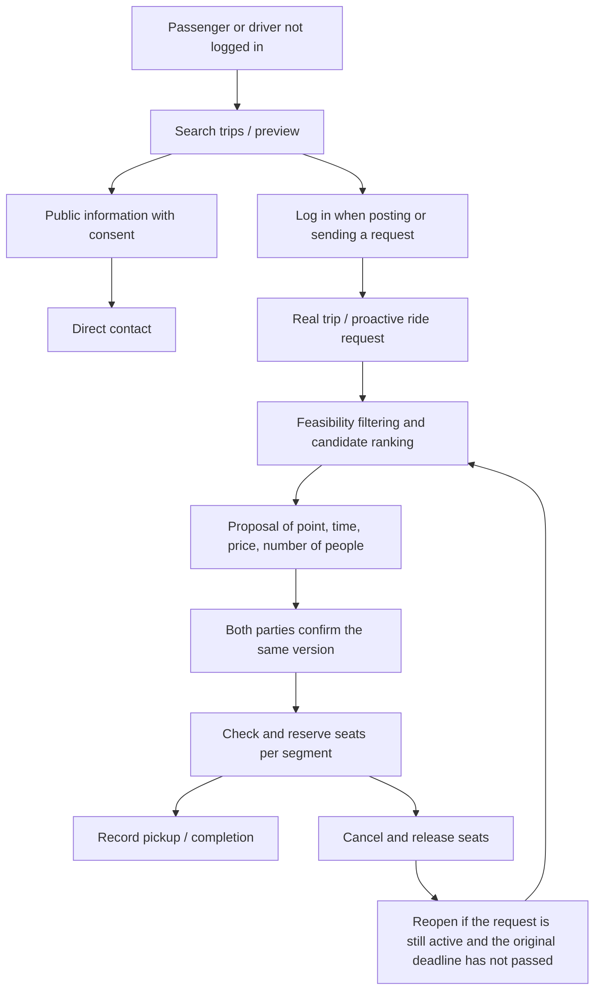

# CarMate — Spatio-temporal connection architecture

This document describes the accepted model for the new flow on `dev`. The research modules and legacy flows still need to be cross-checked when changed; an algorithm's name does not prove that the whole system satisfies a theorem or a level of service in the field.

Product contract: [CONNECTION_FLOW.md](docs/CONNECTION_FLOW.md). Operations: [OPERATIONAL_WORKFLOW.md](docs/OPERATIONAL_WORKFLOW.md).

## 1. Layers

- Web: React, Vite, Tailwind; `App.jsx` holds navigation and the resume-after-login action.
- API: Express; checks identity, ownership, conditions and deadlines on the server.
- SQLite: the source of truth for trip, ride request, proposal and commitment state. Browser storage only supports the experience; it does not decide permissions or capacity.
- Shared: corridors/stations, geometry, forecasting and normalization of shared conditions.

## 2. Two independent datasets

**Supply:** trips posted by drivers that are still valid. A trip has a corridor, direction, time, passenger seats, a real vehicle and pickup/price conditions. Do not duplicate one trip into several supply sources by creating duplicate hidden intents.

**Demand:** ride requests that passengers proactively post or requests they send, with origin/destination, number of people, a time range and a deadline while a vehicle is still needed. A single search or revealing a phone number does not by itself create demand.

The guest driver preview is a read operation: `POST /connections/driver-preview`. It evaluates the draft against real demand and returns a summary of route/time/number of people and the reasons it fits. It does not create a trip, reserve seats, or reveal the passenger's name, phone number or home address.

## 3. Spatial representation and both directions

The existing Frenet core in `packages/shared/src/utils/stanfordFrenet.js` projects a position into:

- `s`: position along the corridor.
- `d`: offset from the reference path.

An outbound–return route can be represented as one reference cycle, but the same station must distinguish the direction in which the vehicle passes through. The real date and time must not be lost when converting a recurring schedule to a cycle.

A passenger's segment must lie within the vehicle's route and be in the same direction. Checks must not assume `s` always increases; the return direction is also a valid journey. A station outside the speed profile must not return an ETA of 0 and be labeled valid.

## 4. Time and ETA

A vehicle is a candidate only when its window for passing the pickup point intersects the window in which the passenger can still travel:

\[
I_{veh,pickup} \cap I_{passenger} \neq \varnothing
\]

The time to reach a station must add the offset from the departure point to the mid-route pickup point. The system uses both date and time, and handles crossing midnight in the Vietnam time zone.

`stochasticEta.js` contains the ETA model with a mean and uncertainty. This is a forecast that needs calibrating against real data, not an arrival time the driver has committed to. Position and schedule information must be suitably fresh.

The gap between two consecutive eligible vehicles is a different quantity from the flexibility margin `delta` around a request's time. To publish a claim of “wait no longer than Δ”, one must verify the largest gap in the real vehicle supply, the pickup conditions, remaining seats and the service window; average density is not enough.

## 5. Hybrid pickup points

| Field | Meaning |
| --- | --- |
| `pickupMode: station` | Pickup at the agreed station. |
| `pickupMode: doorstep` | Door-to-door pickup is possible; a specific location must be agreed. |
| `pickupMode: hybrid` | A station or another point if both parties agree. |
| `maxDetourKm` | Detour limit declared by the driver. |
| `pickupNotes` | Conditions or description of the pickup point. |

Stations organize the search; they do not replace the final pickup point. If door-to-door pickup coordinates are missing, do not invent a time or detour distance. Passengers/drivers can still communicate directly to clarify.

Amenity/stopping-point data needs a real source. That a location is near the route does not mean every vehicle is allowed or willing to stop there.

## 6. Filtering and ranking candidates

`apps/api/src/services/connectionMatching.js` evaluates:

1. The trip and ride request are still valid.
2. Same direction; the passenger's segment lies within the vehicle's route.
3. Seats remain on the corresponding segment.
4. The time windows intersect after accounting for the time to reach the station.
5. Pickup-point conditions and the detour limit are compatible.
6. User preferences, such as time or a known price.

Compatibility graphs, stable matching, batch processing and multi-criteria ranking are related research directions. **The current result is a ranked suggestion over the available data; it does not claim global optimality, Pareto optimality, or the absence of blocking pairs in reality.**

Do not turn matcher results into automatic pickups. Real supply capacity and the confirmation of both parties are separate conditions.

## 7. Commitment and per-segment capacity

`apps/api/src/services/bookingCommitment.js` centralizes the checks of both parties' rights, the proposal version and capacity.

| Status | Meaning |
| --- | --- |
| `inquiring` | Discussing/searching; no seat reserved yet. |
| `pre_confirmed` | A proposal of conditions exists, awaiting the other party's confirmation; a seat is not assumed by default. |
| `confirmed` | Both parties have agreed to the exact version; the server has checked and reserved the seat. |
| `boarded` | The passenger's boarding is recorded. |
| `completed` | Completion is recorded. |
| `cancelled` / `expired` | The appointment or ride request has ended under the corresponding conditions. |

A change in price, point, time, number of people or vehicle creates a new proposal version. An old confirmation is not valid for the new conditions.

On each segment `e`:

\[
\sum_{b \text{ occupying segment }e} seats_b \leq capacity_{passenger}
\]

At the same station, a passenger getting off frees the seat before a new passenger boards. Reserving/releasing seats must be consistent under concurrent processing and idempotent. A full segment does not mean the whole route has stopped accepting passengers.

## 8. Cancellation and re-search

When cancelling before pickup, release the seat exactly once. If the passenger still needs a vehicle and the original deadline is still valid, reopen the ride request with `originalRequestedAt`, `originalDeadlineAt` and the original time constraint.

`needsReplacement` only indicates that a re-search is needed. It does not prove that a backup vehicle exists. Replacing a vehicle must create a new proposal and receive a new confirmation; do not automatically preserve the price or assign another vehicle to the passenger. An incident after boarding is a separate journey-handling flow.

## 9. Pricing and legacy formulas

Current pricing contract:

- `pricingMode: listed`: `basePricePerSeat` is the price entered by the driver.
- `pricingMode: contact`: `basePricePerSeat: null`; display “Liên hệ” (Contact), do not coerce it to 0.
- CarMate has no commission, retained share, mandatory fare table, or floor/ceiling bound based on fuel cost.

Legacy modules such as `getFixedSegmentTariff`, pricing/fuel, and the names “Shapley” or “Nash” belong to the previous model. A formula of the form:

\[
\widehat C = C_{fixed} + \widehat d\,c_{km} + BOT
\]

can only be used as an **optional reference estimate**, with clear sources and assumptions. Haversine measures distance on a sphere; the road factor is an approximation that needs calibration. Those values must not override the driver's price or become a mandatory condition for connecting.

A function that looks up a price table does not by itself become a Shapley computation. To invoke an algorithm's axioms or guarantees, one must point to the correct model, implementation and corresponding evidence.

## 10. Identity, data and verification

- The listing owner chooses whether to publish the contact number. Google/Telegram login confirms the account identity from the provider; it does not by itself verify every separately entered phone number.
- Write APIs require a valid session; do not trust permissions from a `userId` sent by the passenger. Conversations and manifests are only for parties with rights.
- Do not use fake data, fake tokens, call-back promises or hard-coded statistics to boost conversion.
- The assistant/NLP flow is a separate part; see [NATIVE_INTENT_FLOW.md](docs/NATIVE_INTENT_FLOW.md).
- Pure tests verify data conditions; API tests verify permissions and transactions; browser tests verify interactions and state. Real login and pickup quality need to be tested separately.
- Production configuration and data must not be used as test data. Follow the `dev` branch workflow and the UI conventions in [AGENTS.md](AGENTS.md).
