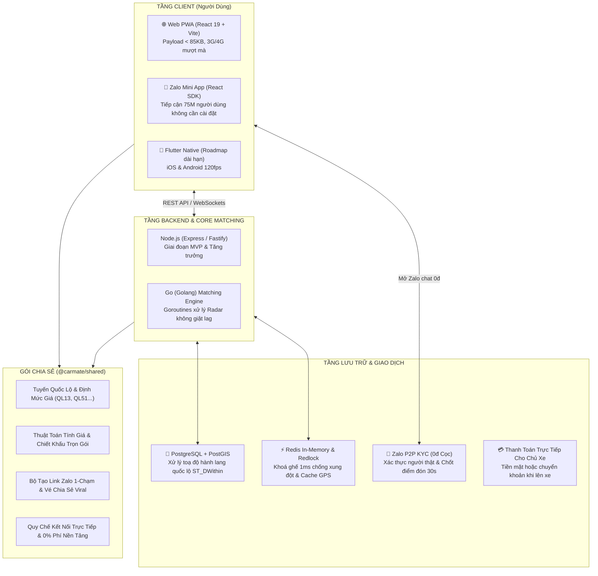
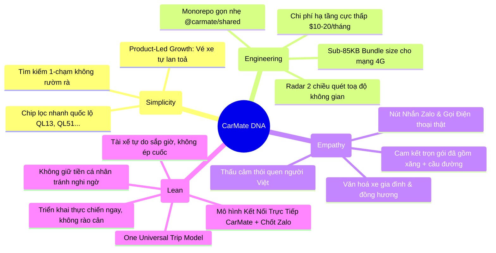
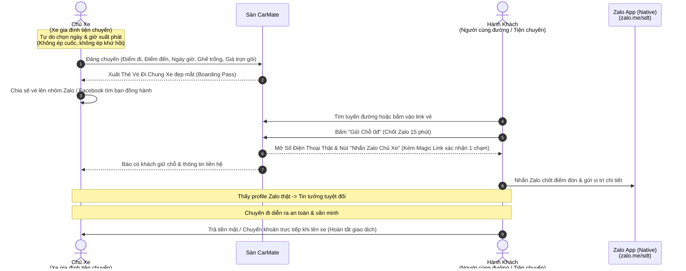
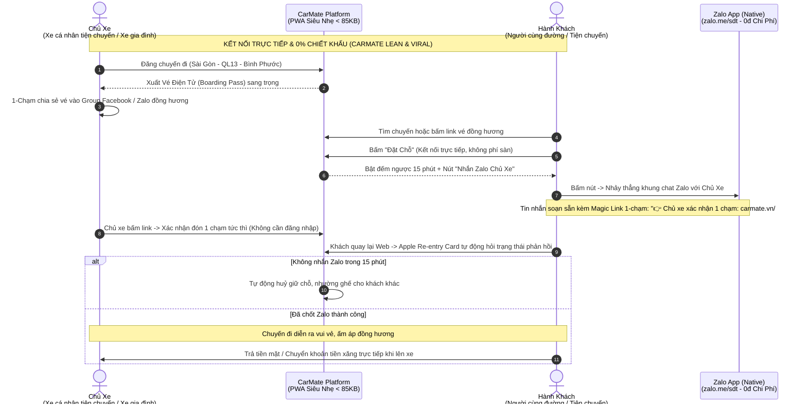
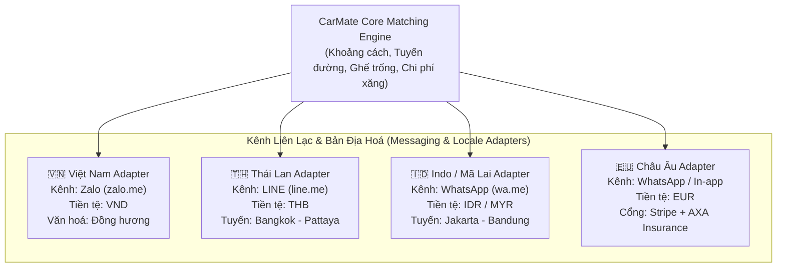

# 🏛️ CarMate — Kiến Trúc Hệ Thống & Tài Liệu Thiết Kế (System Architecture)

> **Tài liệu Thiết kế Kiến trúc Toàn diện (Comprehensive Architecture & Design Document)**  
> Bốn nguyên tắc thiết kế xuyên suốt: **Tối giản & tăng trưởng tự thân** • **Hiệu năng và chi phí vận hành thấp** • **Thấu cảm văn hoá bản địa** • **Khởi nghiệp tinh gọn, không giữ tiền trung gian**.

---

## 1. Sơ Đồ Kiến Trúc Hệ Thống Tổng Thể (System Architecture Diagram)



---

## 2. Bốn Trụ Cột Thiết Kế



### 2.1. Tối giản hoá & Tăng trưởng tự thân (PLG)

- **1-Click Search:** Người dùng không phải điền biểu mẫu phức tạp. Chọn nhanh các tuyến huyết mạch bằng các chip bấm tức thì.
- **Viral Boarding Pass:** Tự động xuất tấm vé ảnh sang trọng có mộc bảo chứng của CarMate để chủ xe tự mang đi đăng vào các hội nhóm Zalo/Facebook tìm bạn đồng hành, biến mỗi người dùng thành một kênh phân phối tự nhiên.

### 2.2. Hiệu năng & Chi phí vận hành tối thiểu

- **Monorepo Architecture:** Cấu trúc `apps/web`, `apps/api`, `packages/shared` giúp tái sử dụng 100% logic tính giá và kiểm tra dữ liệu.
- **Tối ưu payload mạng yếu:** Bundle size toàn bộ web app nén gzip chỉ **84KB**, phản hồi dưới 100ms trên mạng di động dọc các tuyến quốc lộ xa trung tâm.

### 2.3. Thấu cảm văn hoá người Việt

- **Nhu cầu nghe giọng nói & nhắn tin Zalo:** Người Việt tin vào người thật. App cung cấp song song nút **"Gọi Ngay"** (mở trình gọi điện thật) và **"Nhắn Zalo"** (`zalo.me/sdt`).
- **Tâm lý đồng hương & xe gia đình:** Gắn nhãn quê quán (_"Đồng hương Lộc Ninh"_, _"Đồng hương Vũng Tàu"_...) và cam kết _"Không khói thuốc"_, _"Đã gồm tiền xăng + phí cầu đường"_.

### 2.4. Khởi nghiệp tinh gọn, không rủi ro pháp lý

- **Dự án cộng đồng văn minh phi thương mại:** Kết nối những người cùng đường chia sẻ chi phí nhiên liệu. Hoàn toàn hợp pháp theo Nghị định 52/2013 & 85/2021 về TMĐT, không rủi ro pháp lý.
- **Sáng kiến Giữ Chỗ 0đ Của CarMate (Không cầm tiền trung gian):** Tuyệt đối không bắt khách nạp tiền hay chuyển cọc vào tài khoản cá nhân của Founder (tránh tâm lý e ngại lừa đảo). Khách giữ chỗ 0đ, cam kết bằng danh tính thật qua Zalo trong 15 phút, thanh toán tiền mặt/chuyển khoản trực tiếp cho chủ xe khi bước lên xe.
- **Tự nhiên hoá KYC qua Zalo & Magic Link 1-Chạm:** Không tốn tiền mua dịch vụ eKYC đắt đỏ. Dùng đường link `https://zalo.me/[sdt]` (0đ thủ tục, 0đ chi phí), tận dụng hồ sơ Zalo thật của người dùng kết hợp Magic Link (`/#confirm-[code]`) và Apple Re-entry Card khép kín luồng trạng thái hai chiều.

---

## 3. Mô Hình Chuyến Đi Thống Nhất (The "One Universal Trip" Model)

Hệ thống **KHÔNG phân loại phức tạp** giữa xe cá nhân đi làm và người cần đi cùng. Cả hai đều dùng chung một mô hình chuyến đi bình đẳng:



---

## 4. Vai Trò Nền Tảng: Chỉ Kết Nối

CarMate không điều phối chuyến đi và không là một bên trong thoả thuận giữa hai người dùng:

- **Hai bên tự thoả thuận:** Điểm đón trả, giờ giấc, hành lý và mọi yêu cầu riêng do chủ xe và người đi cùng trao đổi trực tiếp qua Zalo.
- **Không định giá, không sắp lịch:** Nền tảng chỉ hiển thị định mức chi phí tham khảo theo tiêu hao nhiên liệu và phí cầu đường từng tuyến.
- **Thông tin do thành viên đăng:** Nội dung chuyến do thành viên tự đăng và tự chịu trách nhiệm. Ai cần cam kết dịch vụ chặt chẽ hơn thì tự thoả thuận riêng.

## 5. Cấu Trúc Thư Mục Monorepo Thực Tế

```text
carmate/
├── package.json                        # Root Workspace cấu hình ["apps/*", "packages/*"]
├── ARCHITECTURE.md                     # Tài liệu thiết kế hệ thống chuyên sâu (Tài liệu này)
├── README.md                           # Hướng dẫn chạy và tổng quan mã nguồn
│
├── packages/
│   └── shared/                         # @carmate/shared (Dùng chung cho Web & API)
│       ├── package.json
│       └── src/
│           ├── index.js                # Xuất khẩu toàn bộ module tập trung
│           ├── constants/
│           │   ├── routes.js           # 10 tuyến quốc lộ chính & định mức giá
│           │   ├── timeSlots.js        # Khung giờ di chuyển linh hoạt
│           │   ├── policies.js         # Quy chế kết nối trực tiếp, 0% phí sàn, cam kết văn minh đôi bên
│           │   └── mockData.js         # Dữ liệu mẫu tích hợp nhãn văn hoá đồng hương
│           └── utils/
│               ├── pricing.js          # Thuật toán tính giá trọn gói (gồm xăng + cầu đường)
│               └── zalo.js             # Helper mở Zalo chat 1-chạm & sinh nội dung chia sẻ vé
│
└── apps/
    ├── web/                            # @carmate/web (React 19 + Vite + TailwindCSS)
    │   ├── package.json
    │   ├── vite.config.js              # Build siêu tốc HMR < 50ms
    │   ├── index.html                  # Giao diện chuẩn typography
    │   └── src/
    │       ├── main.jsx                # Entry point
    │       ├── App.jsx                 # Bộ điều phối state & tabs (~220 dòng sạch sẽ)
    │       ├── index.css               # Design system & dark mode
    │       └── components/
    │           ├── common/             # Header, Footer, BottomNav, Toast
    │           ├── ui/                 # Design system: Button, Chip, Modal, Field, Badge
    │           ├── market/             # FilterBar (Chip quốc lộ), TripCard, RouteBenchmarkBar
    │           ├── post/               # PostTripForm (Đăng chuyến & kích hoạt thẻ vé)
    │           ├── radar/              # MatchRadarView (Khớp lệnh toạ độ 2 chiều)
    │           ├── booked/             # BookedTripList (Mở SĐT thật & Nút Nhắn Zalo)
    │           ├── vip/                # VipSubscriptionView (Gói VIP Pro 99k)
    │           └── modals/             # TicketShareModal (Vé PLG), EscrowBookingModal, PolicyModal, CancelModal, DelayModal, CallModal
    │
    └── api/                            # @carmate/api (Backend REST API)
        ├── package.json
        └── src/
            ├── index.js                # Port 4000: /api/trips, /api/escrows, /api/matches, /api/health
            └── routes/                 # Định tuyến module hoá
```

---

## 6. Mô Hình Khởi Nghiệp Lean & Quy Trình Chốt Ghế 0đ (Phase 1 Testing)



---

## 7. Lộ Trình Phát Triển 4 Pha & Chiến Lược Toàn Cầu (Phased Roadmap & Global Strategy)

### 7.1. Bảng Tổng Quan 4 Giai Đoạn (Evolution Matrix)

| Giai Đoạn                                           | Trọng Tâm & Quy Mô                                                                                                | Cơ Chế Giữ Chỗ & Thanh Toán                                                                           | Mô Hình Doanh Thu (Monetization)                                                                                                              | Hạ Tầng Pháp Lý & Kỹ Thuật                                                                        |
| :-------------------------------------------------- | :---------------------------------------------------------------------------------------------------------------- | :---------------------------------------------------------------------------------------------------- | :-------------------------------------------------------------------------------------------------------------------------------------------- | :------------------------------------------------------------------------------------------------ |
| **Pha 1: Khởi Động Lean (0 - 6 tháng)**             | • 1-2 hành lang (QL13, QL51)<br>• 100 - 500 thành viên đầu tiên<br>• Tập trung vào độ sướng & tiện đường đi chung | • **Kết nối trực tiếp**<br>• Chốt Zalo trong 15 phút<br>• Thanh toán tiền mặt/chuyển khoản khi lên xe | • **0% Chiết khấu cước xe** (Xây dựng cộng đồng tiện chuyến)<br>• Tối đa hoá tính lan toả (Viral Loop)                                        | • Solo founder (chưa cần GPKD)<br>• Zero-cost stack: Cloudflare Pages, Node.js + PWA              |
| **Pha 2: Mật Độ Hành Lang (6 - 18 tháng)**          | • Phủ kín các trục chính: QL1A, Cao tốc Trung Lương, QL20 Đà Lạt<br>• 5.000+ chuyến/tháng                         | • 0% phí sàn · Kết nối trực tiếp qua Zalo / Số điện thoại thật                                        | • **Mô hình Chợ Tốt / Freemium:**<br> - Phí "Đẩy bài hỏa tốc" (5k - 10k/lần)<br> - Gói Chủ Xe Uy tín (49k/tháng)<br>• KHÔNG cắt phế % cuốc xe | • Đăng ký Hộ kinh doanh cá thể<br>• Postgres + Redis Redlock<br>• Zalo Mini App chính thức        |
| **Pha 3: Dịch Vụ Giá Trị Gia Tăng (18 - 36 tháng)** | • Mở rộng toàn quốc (Bắc - Trung - Nam)<br>• Bổ sung tuyến liên tỉnh cố định                                      | • Ví điện tử liên kết (MoMo, ZaloPay) + Trực tiếp                                                     | • **Bảo hiểm vi mô (Micro-insurance):** 5.000đ/vé (hoa hồng 30%)<br>• Bán chéo Voucher cây xăng (Petrolimex), gara, trạm dừng chân            | • Thành lập Công ty TNHH / Cổ phần<br>• Matching Engine bằng Golang đa luồng                      |
| **Pha 4: Mở Rộng Khu Vực & Toàn Cầu (3+ năm)**      | • Đông Nam Á (Thái Lan, Indo, Philippines)<br>• Châu Âu & Quốc tế                                                 | • Thẻ Quốc tế (Stripe, Apple Pay), E-Wallets địa phương                                               | • Phí dịch vụ nền tảng (Booking fee 10-12% từ hành khách theo chuẩn chia sẻ xe quốc tế)                                                       | • Global Multi-region Cloud (AWS/GCP)<br>• Đa ngôn ngữ, Đa tiền tệ, Đa cổng chat (LINE, WhatsApp) |

---

### 7.2. Phân Tích Chiến Lược Bản Địa Hoá & Toàn Cầu

#### A. Tại sao KHÔNG thu phí % giao dịch tại Việt Nam (The Anti-"Tắt App Chạy Ngoài" Rule)

- Các ứng dụng như Grab, Be thu 25% - 30% khiến tài xế luôn tìm cách rủ khách "tắt app chạy ngoài" để giữ trọn tiền.
- CarMate thấu hiểu tâm lý người Việt: **Thích miễn phí cốt lõi nhưng sẵn sàng chi tiền lẻ mua Tiện ích & Vị thế.**
- Thu tiền qua **Dịch vụ Đẩy tin (5k - 10k)** và **Huy hiệu Uy tín (49k/tháng)** giúp nền tảng có dòng tiền đều đặn mà không bao giờ can thiệp thô bạo vào túi tiền xăng của tài xế.

#### B. Chiến lược "Đánh chiếm từng hành lang" (Corridor-by-Corridor Playbook)

- Đi chung xe thành công nhờ **Mật độ chuyến (Density)** chứ không nhờ độ phủ rải rác.
- **Chiến lược hành lang CarMate:** Bắt đầu bằng ĐÚNG 1 TRỤC HUYẾT MẠCH DUY NHẤT. CarMate tập trung nguồn lực vào tuyến **Sài Gòn <-> Bình Phước (QL13)** và **Sài Gòn <-> Vũng Tàu (QL51)** trước. Khi một hành lang đạt độ tin cậy "cứ mở app là có xe tiện chuyến cùng đường", công thức sẽ tự động nhân bản sang các trục tiếp theo.

#### C. Kiến trúc Kỹ thuật Mở Rộng Quốc Tế (Global Core, Hyper-local Adapters)

Kiến trúc Monorepo hiện tại của CarMate đã được thiết kế sẵn sàng cho việc mở rộng quốc tế thông qua các Adapter giao tiếp bản địa:



---

## 8. Tiêu Chuẩn Bảo Mật & An Toàn Xác Thực Danh Tính (Security & Token Cryptography)

Để phòng chống hoàn toàn các lỗ hổng chiếm quyền tài khoản (Account Takeover), CarMate triển khai chuẩn bảo mật nghiêm ngặt:

1. **Google Identity Verification:** Backend bắt buộc kiểm tra chữ ký `idToken` thông qua Google Tokeninfo Endpoint (`oauth2.googleapis.com/tokeninfo`). Tuyệt đối không chấp nhận email thô từ client request body.
2. **Zalo Identity Verification:** Backend bắt buộc xác thực `accessToken` thông qua Zalo Open Graph API (`graph.zalo.me/v2.0/me`). Mọi yêu cầu không có token hợp lệ đều bị chặn với HTTP 401.
3. **Phone OTP Verification:** Đăng nhập trực tiếp bằng số điện thoại bắt buộc trải qua luồng xác thực mã OTP 6 chữ số (TTL 5 phút, giới hạn tần suất 5 lần/ngày), triệt tiêu hoàn toàn nguy cơ mạo danh số điện thoại người khác.
4. **Request Tracing & Observability:** Header `x-request-id` được tự động sinh (hoặc bảo toàn từ client) và ghi vết trong toàn bộ structured log, giúp việc phát hiện và điều tra sự cố (incident investigation) diễn ra tức thì.
5. **Database Indexing:** Bảng `users` và `trips` được lập chỉ mục `idx_users_email`, `idx_users_phone`, `idx_trips_phone` đảm bảo tốc độ truy vấn $O(1)$, không xảy ra hiện tượng Full Table Scan khi lượng người dùng tăng trưởng vượt bậc.

---

## 9. Kết Luận Kiến Trúc

Kiến trúc CarMate là sự dung hòa tối ưu giữa **tầm nhìn toàn cầu dài hạn** và **sự thực dụng tối đa cho giai đoạn số 0**:

1. **0 đồng rủi ro pháp lý & tài chính** cho Solo Founder khi vận hành miễn phí 100%.
2. **0 rào cản tham gia** cho người dùng (0đ cọc, không cần nạp tiền, Zalo 1 chạm).
3. **Mã nguồn Monorepo sạch sẽ, module hoá**, sẵn sàng mở rộng quy mô mà không cần đập đi xây lại.
