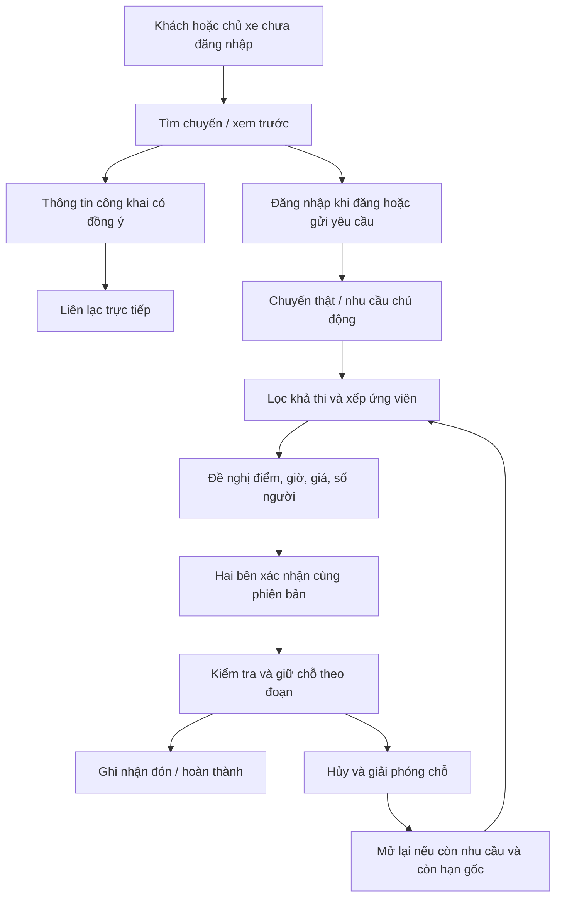

# CarMate — Kiến trúc kết nối không gian–thời gian

Tài liệu này mô tả mô hình được chấp nhận cho luồng mới trên `dev`. Các mô-đun nghiên cứu và luồng cũ vẫn cần được đối chiếu khi thay đổi; tên thuật toán không chứng minh toàn hệ thống đạt một định lý hoặc mức phục vụ ngoài thực địa.

Hợp đồng sản phẩm: [CONNECTION_FLOW.md](docs/CONNECTION_FLOW.md). Vận hành: [OPERATIONAL_WORKFLOW.md](docs/OPERATIONAL_WORKFLOW.md).

## 1. Phân lớp

- Web: React, Vite, Tailwind; `App.jsx` giữ điều hướng và hành động tiếp tục sau đăng nhập.
- API: Express; kiểm tra danh tính, quyền sở hữu, điều kiện và thời hạn tại máy chủ.
- SQLite: nguồn trạng thái chuyến, nhu cầu, đề nghị và cam kết. Bộ nhớ trình duyệt chỉ hỗ trợ trải nghiệm, không quyết định quyền hoặc sức chứa.
- Shared: hành lang/trạm, hình học, dự báo và chuẩn hóa điều kiện dùng chung.

## 2. Hai tập dữ liệu độc lập

**Nguồn cung:** các chuyến do chủ xe đăng và còn hiệu lực. Một chuyến có hành lang, hướng, thời gian, chỗ nhận khách, xe thật và điều kiện đón/giá. Không nhân bản một chuyến thành nhiều nguồn cung bằng cách tạo intent ngầm trùng lặp.

**Nguồn cầu:** khách chủ động đăng nhu cầu hoặc gửi yêu cầu, có điểm đi/đến, số người, khoảng giờ và hạn còn cần xe. Một lượt tìm hoặc mở số điện thoại không tự tạo nguồn cầu.

Guest driver preview là phép đọc: `POST /connections/driver-preview`. Nó đánh giá bản nháp với nguồn cầu thật, trả tóm tắt hành trình/thời gian/số người và lý do phù hợp. Nó không tạo chuyến, đặt chỗ hoặc tiết lộ tên, số điện thoại, địa chỉ nhà khách.

## 3. Biểu diễn không gian và hai chiều

Lõi Frenet hiện có trong `packages/shared/src/utils/stanfordFrenet.js` chiếu vị trí thành:

- `s`: vị trí dọc hành lang.
- `d`: khoảng lệch khỏi đường tham chiếu.

Tuyến đi–về có thể biểu diễn như một chu kỳ tham chiếu, nhưng cùng một trạm phải phân biệt hướng xe đi qua. Ngày giờ thực không được mất khi quy đổi lịch lặp lại sang chu kỳ.

Một đoạn khách đi phải nằm trong hành trình xe và cùng chiều. Các kiểm tra không được mặc định `s` luôn tăng; chiều quay về cũng là hành trình hợp lệ. Trạm ngoài hồ sơ vận tốc không được trả ETA bằng 0 rồi gắn nhãn hợp lệ.

## 4. Thời gian và ETA

Một xe chỉ là ứng viên khi cửa sổ qua điểm đón giao với cửa sổ khách còn có thể đi:

\[
I_{xe,đón} \cap I_{khách} \neq \varnothing
\]

Thời gian tới trạm phải cộng độ lệch từ điểm xuất phát đến điểm đón giữa tuyến. Hệ thống dùng cả ngày và giờ, xử lý qua nửa đêm theo múi giờ Việt Nam.

`stochasticEta.js` chứa mô hình ETA với trung bình và độ bất định. Đây là dự báo cần hiệu chỉnh bằng dữ liệu thực, không phải giờ đến đã được chủ xe cam kết. Thông tin vị trí và lịch phải có độ mới phù hợp.

Khoảng cách giữa hai xe liên tiếp đủ điều kiện là một đại lượng khác với biên linh hoạt `delta` quanh giờ của một yêu cầu. Muốn công bố “chờ không quá Δ”, phải kiểm chứng khoảng trống lớn nhất của nguồn xe thực, điều kiện nhận đón, ghế còn và khung phục vụ; mật độ trung bình không đủ.

## 5. Điểm đón hybrid

| Trường | Ý nghĩa |
| --- | --- |
| `pickupMode: station` | Nhận tại trạm đã thống nhất. |
| `pickupMode: doorstep` | Có thể đón tận nơi, cần thống nhất địa điểm cụ thể. |
| `pickupMode: hybrid` | Trạm hoặc điểm khác nếu hai bên đồng ý. |
| `maxDetourKm` | Giới hạn đi vòng chủ xe khai báo. |
| `pickupNotes` | Điều kiện hoặc mô tả điểm đón. |

Trạm tổ chức việc tìm kiếm; nó không thay thế điểm đón cuối cùng. Nếu thiếu tọa độ đón tận nơi, không bịa thời gian hoặc khoảng đi vòng. Khách/chủ xe vẫn có thể trao đổi trực tiếp để làm rõ.

Dữ liệu tiện ích/trạm đỗ cần nguồn thực. Việc một địa điểm nằm gần tuyến không có nghĩa mọi xe được phép hoặc sẵn lòng dừng ở đó.

## 6. Lọc và xếp ứng viên

`apps/api/src/services/connectionMatching.js` đánh giá:

1. Chuyến và nhu cầu còn hiệu lực.
2. Cùng hướng, đoạn khách đi nằm trong hành trình xe.
3. Còn ghế trên đoạn tương ứng.
4. Khoảng giờ có giao sau khi tính thời gian tới trạm.
5. Điều kiện điểm đón và giới hạn đi vòng tương thích.
6. Ưu tiên người dùng, chẳng hạn thời gian hoặc giá đã biết.

Đồ thị tương thích, ghép cặp ổn định, xử lý theo đợt và xếp hạng đa tiêu chí là các hướng nghiên cứu liên quan. **Kết quả hiện tại là đề xuất có xếp hạng trên dữ liệu đang có; không khẳng định tối ưu toàn cục, Pareto tối ưu hay không tồn tại cặp chặn ngoài thực tế.**

Không biến kết quả matcher thành nhận đón tự động. Năng lực cung ứng thực và xác nhận của hai bên là điều kiện riêng.

## 7. Cam kết và sức chứa theo đoạn

`apps/api/src/services/bookingCommitment.js` tập trung kiểm tra quyền hai bên, phiên bản đề nghị và sức chứa.

| Trạng thái | Ý nghĩa |
| --- | --- |
| `inquiring` | Đang trao đổi/tìm; chưa giữ chỗ. |
| `pre_confirmed` | Có đề nghị điều kiện, chờ bên kia xác nhận; chưa mặc định có ghế. |
| `confirmed` | Hai bên đã đồng ý đúng phiên bản; máy chủ đã kiểm tra và giữ chỗ. |
| `boarded` | Có ghi nhận khách đã lên xe. |
| `completed` | Có ghi nhận hoàn thành. |
| `cancelled` / `expired` | Cuộc hẹn hoặc nhu cầu đã kết thúc theo điều kiện tương ứng. |

Giá, điểm, giờ, số người hoặc xe thay đổi tạo phiên bản đề nghị mới. Xác nhận cũ không có hiệu lực cho điều kiện mới.

Trên mỗi đoạn `e`:

\[
\sum_{b \text{ chiếm đoạn }e} seats_b \leq capacity_{khách}
\]

Tại cùng trạm, khách xuống giải phóng chỗ trước khi khách mới lên. Giữ/hủy chỗ phải nhất quán khi xử lý đồng thời và idempotent. Việc một đoạn đầy không có nghĩa toàn hành trình đã ngừng nhận khách.

## 8. Hủy và tìm lại

Khi hủy trước đón, giải phóng chỗ đúng một lần. Nếu khách vẫn cần xe và hạn gốc còn hiệu lực, mở lại nhu cầu với `originalRequestedAt`, `originalDeadlineAt` và ràng buộc giờ gốc.

`needsReplacement` chỉ thể hiện cần tìm lại. Nó không chứng minh đã có xe dự phòng. Thay xe phải tạo đề nghị và nhận xác nhận mới; không tự bảo lưu giá hoặc gán xe khác cho khách. Sự cố sau khi lên xe là luồng xử lý hành trình riêng.

## 9. Giá và các công thức kế thừa

Hợp đồng giá hiện hành:

- `pricingMode: listed`: `basePricePerSeat` là giá chủ xe nhập.
- `pricingMode: contact`: `basePricePerSeat: null`; hiển thị “Liên hệ”, không quy về 0.
- CarMate không có hoa hồng, phần giữ lại, bảng cước bắt buộc hay cận sàn/trần theo chi phí nhiên liệu.

Các mô-đun cũ như `getFixedSegmentTariff`, pricing/fuel, các tên “Shapley” hoặc “Nash” thuộc mô hình trước. Công thức dạng:

\[
\widehat C = C_{cố\ định} + \widehat d\,c_{km} + BOT
\]

chỉ có thể dùng làm **ước tính tham khảo tùy chọn**, với nguồn và giả định rõ ràng. Haversine đo khoảng cách trên mặt cầu; hệ số đường bộ là xấp xỉ cần hiệu chỉnh. Những giá trị đó không được ghi đè giá chủ xe hoặc biến thành điều kiện bắt buộc để kết nối.

Một hàm gọi bảng giá không tự trở thành phép tính Shapley. Muốn viện dẫn các tiên đề hoặc bảo đảm của thuật toán phải chỉ ra đúng mô hình, triển khai và bằng chứng tương ứng.

## 10. Danh tính, dữ liệu và kiểm chứng

- Chủ tin chọn có công khai số liên hệ. Đăng nhập Google/Telegram xác nhận danh tính tài khoản từ nhà cung cấp, không tự xác minh mọi số điện thoại nhập riêng.
- API ghi dữ liệu yêu cầu phiên hợp lệ; không tin quyền từ `userId` do khách gửi. Cuộc trò chuyện và manifest chỉ dành cho bên có quyền.
- Không dùng dữ liệu giả, token giả, lời hứa gọi lại hoặc thống kê hard-code để tăng chuyển đổi.
- Luồng trợ lý/NLP là phần riêng; xem [NATIVE_INTENT_FLOW.md](docs/NATIVE_INTENT_FLOW.md).
- Test thuần xác minh điều kiện dữ liệu; test API xác minh quyền và giao dịch; test trình duyệt xác minh thao tác và trạng thái. Đăng nhập thật và chất lượng đón cần thử riêng.
- Cấu hình và dữ liệu production không được dùng làm dữ liệu kiểm thử. Tuân thủ nhánh `dev` và quy chuẩn giao diện tại [AGENTS.md](AGENTS.md).
