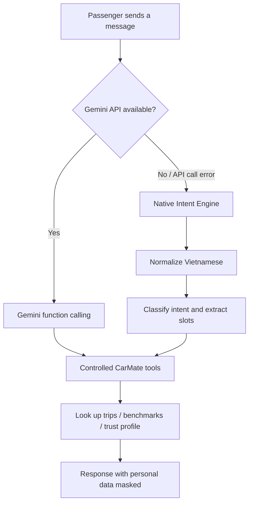
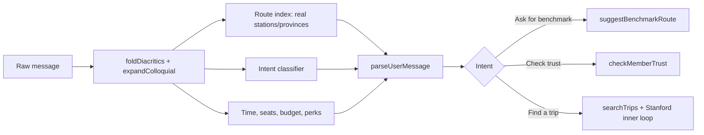

# Assistant & Native Intent Understanding Flow

> Source of truth for how CarMate handles natural-language questions about trips. This document describes the flow that actually runs in `apps/api/src/agent/carmateAgent.js` and the shared functions in `@carmate/shared`.

## Two processing paths, one set of tools



Both branches use only the server-side executors (`searchTrips`, `getRouteBenchmarks`, `checkMemberTrust`, `calculateEstimatedFare`, `draftZaloMessage`). Neither branch may return a real phone number, a PIN, or identifying data outside the scope of the caller's access rights.

## Native Intent Engine

When `GEMINI_API_KEY` is absent, or when the Gemini layer fails, `runCarMateAgent` calls `parseUserMessage`. The engine is deterministic, uses no generative model, and works in the following order:

1. Strip diacritics, normalize Unicode, expand local colloquial abbreviations such as `sg`, `bp`, `dx`.
2. Recognize the intent: find a trip, ask for a benchmark, check trust, cancel a trip, trip status, policy, or greeting.
3. Match the origin/destination against the stations (hubs) and provinces in the system; do not create place names from free text.
4. Extract date, time, number of seats, budget and constraints. The time is always mapped to a real ID in `TIME_SLOTS`; invalid calendar dates are discarded.
5. Pass the matched place phrases (`fromMatch`, `toMatch`) to the lookup layer so trips can still be found when a station's display name is longer than the way the user says it.



## Data invariants

- Only return an origin/destination that belongs to the known catalog of stations (hubs) or provinces.
- `timeSlot` must be an ID in `TIME_SLOTS`; never compose a new time window.
- The date `31/02` and other non-existent dates return `null`; they must not overflow into the following month.
- Adjacent-character transposition typos such as `hnag xanh` are supported without lowering the global fuzzy threshold.
- Trip-search keywords are normalized without diacritics, but display names keep their original Vietnamese for the passenger.

## Verification

```bash
npm run test:intent  # Unit + invariant + performance tests for the Native Intent Engine
npm test             # Includes intent, E2E and the other business engines
```

`scripts/test-intent-engine.mjs` checks the invariants for place names, calendar dates, time-slot IDs, typos and malicious input, as well as the performance target of under 1ms per sentence on the standard test set.
