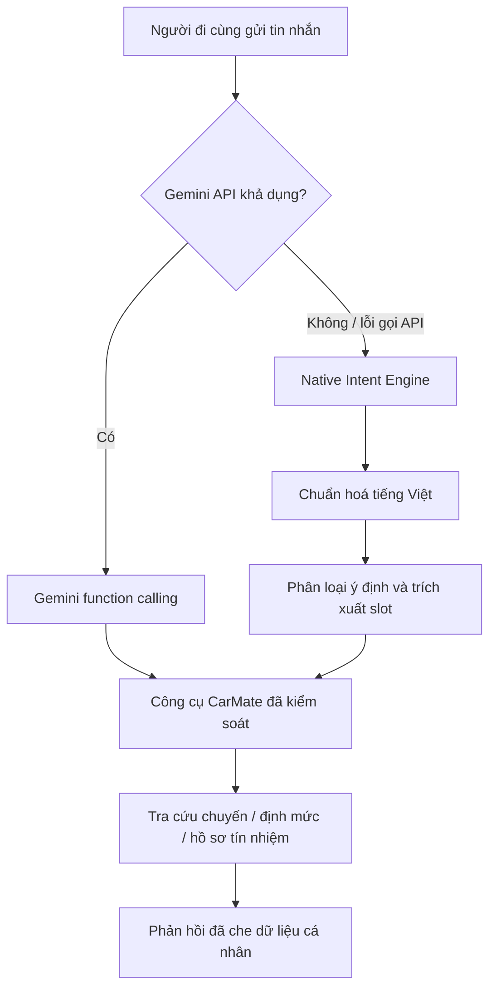
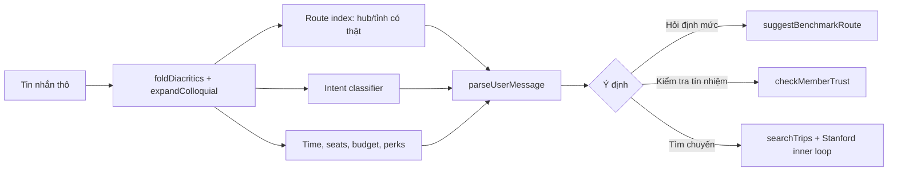

# Luồng Trợ Lý & Hiểu Ý Định Bản Địa

> Nguồn sự thật cho cách CarMate xử lý câu hỏi tự nhiên về chuyến đi. Tài liệu này mô tả đúng luồng đang chạy trong `apps/api/src/agent/carmateAgent.js` và các hàm dùng chung tại `@carmate/shared`.

## Hai đường xử lý, một tập công cụ



Cả hai nhánh chỉ dùng các executor phía máy chủ (`searchTrips`, `getRouteBenchmarks`, `checkMemberTrust`, `calculateEstimatedFare`, `draftZaloMessage`). Không nhánh nào được trả số điện thoại thật, mã PIN, hay dữ liệu nhận dạng ngoài phạm vi quyền truy cập.

## Native Intent Engine

Khi không có `GEMINI_API_KEY`, hoặc khi lớp Gemini lỗi, `runCarMateAgent` gọi `parseUserMessage`. Engine xác định, không dùng mô hình sinh, và thực hiện theo thứ tự sau:

1. Khử dấu, chuẩn hoá Unicode, mở rộng viết tắt bản địa như `sg`, `bp`, `dx`.
2. Nhận diện ý định: tìm chuyến, hỏi định mức, kiểm tra tín nhiệm, huỷ chuyến, trạng thái chuyến, chính sách, hoặc chào hỏi.
3. Đối chiếu điểm đi/đến với hub và tỉnh có trong hệ thống; không tạo địa danh từ văn bản tự do.
4. Trích xuất ngày, giờ, số ghế, ngân sách và ràng buộc. Giờ luôn được đổi sang một ID có thật trong `TIME_SLOTS`; ngày lịch không hợp lệ bị loại bỏ.
5. Chuyển cụm địa danh đã khớp (`fromMatch`, `toMatch`) sang lớp tra cứu để vẫn tìm được chuyến khi tên hiển thị của hub dài hơn cách người dùng nói.



## Bất biến dữ liệu

- Chỉ trả điểm đi/đến thuộc danh mục hub hoặc tỉnh đã biết.
- `timeSlot` phải là ID trong `TIME_SLOTS`; không tự ghép khoảng giờ mới.
- Ngày `31/02` và các ngày không tồn tại trả về `null`, không được tự tràn sang tháng kế tiếp.
- Lỗi đảo hai ký tự kề như `hnag xanh` được hỗ trợ mà không hạ ngưỡng fuzzy chung.
- Từ khoá tìm chuyến được chuẩn hoá không dấu, nhưng tên hiển thị vẫn giữ nguyên tiếng Việt cho Người đi cùng.

## Kiểm chứng

```bash
npm run test:intent  # Unit + invariant + hiệu năng Native Intent Engine
npm test             # Bao gồm intent, E2E và các engine nghiệp vụ khác
```

`scripts/test-intent-engine.mjs` kiểm tra các bất biến về địa danh, ngày lịch, ID khung giờ, lỗi gõ, đầu vào độc hại và mục tiêu hiệu năng dưới 1ms/câu trên tập kiểm thử chuẩn.
