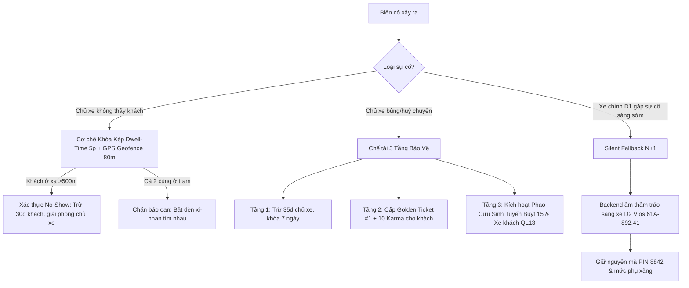

# 📘 CarMate — Sổ Tay Vận Hành Thực Địa Tuyến Hành Lang QL13 (Operational Playbook & Real-World Fail-Safe Architecture)

> **Tài liệu Quy chuẩn Vận hành & Thiết kế Trải nghiệm Thực địa**  
> **Tuyến trọng điểm:** Hành lang Quốc Lộ 13 (Tân Khai / Bình Phước ⇄ Hàng Xanh / TP.HCM)  
> **Áp dụng:** Môi trường Production & Kiểm thử Toàn diện trên nhánh `dev`  
> **Tuân thủ 4 trụ cột kỹ thuật:** MIT Invariants • Stanford Ergonomics • Cursor Ambient Intelligence • Apple Liquid Aesthetics.

---

## MỤC LỤC

1. [Bối Cảnh Thực Tế & Triết Lý Vận Hành Ngoài Đời](#1-bối-cảnh-thực-tế--triết-lý-vận-hành-ngoài-đời)
2. [Quy Trình 4 Nhịp Chuẩn Mực (Happy Case)](#2-quy-trình-4-nhịp-chuẩn-mực-happy-case)
   - [Nhịp 1: Tối Hôm Trước (21:00) — Khớp Lệnh & Khóa Sổ](#nhịp-1-tối-hôm-trước-2100--khớp-lệnh--khóa-sổ)
   - [Nhịp 2: Sáng Hôm Sau (06:15) — Đón 30 Giây Bằng Mã PIN](#nhịp-2-sáng-hôm-sau-0615--đón-30-giây-bằng-mã-pin)
   - [Nhịp 3: Lăn Bánh Trên QL13 (Cruising) — Phụ Xăng VietQR Trên Xe](#nhịp-3-lăn-bánh-trên-ql13-cruising--phụ-xăng-vietqr-trên-xe)
   - [Nhịp 4: Tới Hàng Xanh (D4) — Trả Khách 10 Giây & Đánh Giá 2 Chiều](#nhịp-4-tới-hàng-xanh-d4--trả-khách-10-giây--đánh-giá-2-chiều)
3. [Mạng Lưới An Toàn & Xử Lý Sự Cố (Unhappy Cases)](#3-mạng-lưới-an-toàn--xử-lý-sự-cố-unhappy-cases)
   - [Trường hợp 1: Khách Vắng Mặt Tại Trạm Đón (No-Show)](#trường-hợp-1-khách-vắng-mặt-tại-trạm-đón-no-show)
   - [Trường hợp 2: Khách Bị Huỷ / Bùng Chuyến Sáng Sớm](#trường-hợp-2-khách-bị-huỷ--bùng-chuyến-sáng-sớm)
   - [Trường hợp 3: Xe Chính Đứt Gãy — Chuyển Làn Vô Hình (Silent Fallback N+1)](#trường-hợp-3-xe-chính-đứt-gãy--chuyển-làn-vô-hình-silent-fallback-n1)
4. [Tâm Lý Học Hành Vi & Triết Lý "Zero Doubt Seeding"](#4-tâm-lý-học-hành-vi--triết-lý-zero-doubt-seeding)
5. [Kiến Trúc Phản Ứng Tức Thì Cross-Tab (Reactive Storage Sync)](#5-kiến-trúc-phản-ứng-tức-thì-cross-tab-reactive-storage-sync)
6. [Hệ Thống Bất Biến Toán Học & Tiêu Chuẩn Danh Xưng](#6-hệ-thống-bất-biến-toán-học--tiêu-chuẩn-danh-xưng)

---

## 1. Bối Cảnh Thực Tế & Triết Lý Vận Hành Ngoài Đời

Hành lang Quốc Lộ 13 dài ~85km nối liền các huyện công nghiệp tỉnh Bình Phước (Chơn Thành, Hớn Quản, Bình Long, Tân Khai) với trung tâm TP.HCM (Hàng Xanh, Bến xe Miền Đông, Sân bay Tân Sơn Nhất). 

Mỗi sáng sớm từ **05:30 đến 07:00**, hàng nghìn xe ô tô gia đình (Mitsubishi Xpander, Toyota Vios, Hyundai Accent...) của các công chức, kỹ sư, chuyên gia di chuyển về TP.HCM để kịp giờ làm lúc 8h–8h30. Đa số các xe này còn trống từ 2 đến 4 ghế.

### Thách Thức Cốt Lõi:
1. **Áp lực giờ làm việc:** Hành khách ở Bình Phước dậy từ 05:00 sáng để chuẩn bị đón xe đi Sài Gòn. Nếu chuyến xe bị trễ 15–20 phút hoặc bị bùng sát giờ, toàn bộ ngày làm việc của họ sẽ bị phá hỏng.
2. **Áp lực giao thông & CSGT:** Nút giao Hàng Xanh (Bình Thạnh) là điểm nghẽn giao thông cực lớn với mật độ camera phạt nguội dừng đỗ và lực lượng CSGT dày đặc. Ô tô không thể dừng lâu để loay hoay quét QR hay đếm tiền thối.
3. **Chi phí tin nhắn SMS:** Việc gửi SMS brandname liên tục gây hao tổn ngân sách cho nền tảng phi lợi nhuận/phi trung gian. Nền tảng cần cơ chế xác thực không tốn tiền SMS (In-app Reactive & WebOTP).

---

## 2. Quy Trình 4 Nhịp Chuẩn Mực (Happy Case)

```
[ 21:00 Tối Hôm Trước ] ──> [ 06:15 Sáng Hôm Sau ] ──> [ 06:15 - 07:45 ] ──> [ 07:45 ]
 Khớp lệnh tự động           Đón 30s tại trạm          Lăn bánh QL13          Trả khách 10s
 Zero Doubt Seeding          Xác thực mã PIN           Phụ xăng VietQR        Đánh giá 5 sao
```

### Nhịp 1: Tối Hôm Trước (21:00) — Khớp Lệnh & Khóa Sổ
* **Thao tác Chủ xe:** Bật ý định hành trình trên app: *Tân Khai ➔ Hàng Xanh, 06:15 sáng mai, 2 ghế trống*.
* **Thao tác Người đi cùng:** Chọn điểm đón (Cây xăng Petrolimex Tân Khai) và điểm đến (Hàng Xanh).
* **Cỗ máy khớp lệnh tự động (Gale-Shapley):** Ghép đôi người đi cùng với chủ xe có lịch trình trùng khớp.
* **Nguyên tắc "Zero Doubt Seeding" (Triệt tiêu mầm mống nghi ngờ):**
  - Màn hình khách hiển thị duy nhất một chứng nhận chắc chắn: Xe Mitsubishi Xpander `93A - 541.86` của Anh Tuấn, đón đúng **06:15** kèm **Mã PIN 4 số (8842)**.
  - **Tuyệt đối không hiển thị xe dự phòng** vào ban đêm để khách yên tâm tắt máy đi ngủ, đồng thời chủ xe không cảm thấy bị nghi ngờ.
  - Phía sau hậu trường (Backend): Hệ thống âm thầm xác định một xe dự phòng $N+1$ (Toyota Vios `61A - 892.41` lúc 06:25) nằm trong trạng thái đệm.

---

### Nhịp 2: Sáng Hôm Sau (06:15) — Đón 30 Giây Bằng Mã PIN
* **Địa điểm:** Sảnh cây xăng Petrolimex Tân Khai (mặt tiền QL13).
* **Quy chuẩn đón Curbside (45–60 giây):**
  1. Lúc **06:10**, radar Taplo của chủ xe kích hoạt báo âm thanh đón khách khi xe cách trạm 3.5km. Khách nhận thông báo xe sắp đến.
  2. Chủ xe xi-nhan tấp vào mép ngoài sân cây xăng.
  3. Khách bước ra mở cửa và đọc to mã PIN: **`8842`**.
  4. Chủ xe bấm 4 số trên màn hình Taplo Cockpit: `[ 8 ] [ 8 ] [ 4 ] [ 2 ]`.
  5. Taplo phát âm báo *Ting!* kèm giọng nói: *"Khớp thành công! Chúc quý khách thượng lộ bình an!"*.
  6. Màn hình Cockpit lập tức chuyển sang chế độ **`CRUISING`** (D3.5). Xe lăn bánh trở lại QL13 trong vòng chưa đầy 45 giây.

---

### Nhịp 3: Lăn Bánh Trên QL13 (Cruising) — Phụ Xăng VietQR Trên Xe
* **Thách thức:** Nếu để đến lúc dừng xe tại Hàng Xanh mới rút điện thoại quét mã QR hoặc đếm tiền thừa, xe sẽ bị phạt nguội dừng đỗ hoặc gây ùn tắc giao thông nghiêm trọng.
* **Giải pháp In-Transit VietQR Settlement:**
  1. Ngay khi mã PIN được xác nhận, app của người đi cùng chuyển sang giao diện:  
     `🟢 ĐANG TRÊN HÀNH TRÌNH VỀ HÀNG XANH · QL13 Express`.
  2. Trên app hiển thị thẻ **VietQR Phụ Xăng Trực Tiếp (P2P)**:
     - Số tiền: `50.000đ` (hoặc cước theo km).
     - Ngân hàng: **MB Bank (Quân Đội)** — Số tài khoản: **`0938.884.288`**.
     - Cú pháp: **`CARMATE PIN 8842`** (kèm nút copy 1-chạm).
     - Mã QR động hiển thị trực tiếp để khách quét bằng app ngân hàng của mình.
  3. Khách chuyển khoản hoặc chuẩn bị tiền mặt chẵn ngay trong lúc xe đang chạy trên QL13 (khoảng 70–90 phút).
  4. Sau khi chuyển, khách bấm `[ Đã chuyển khoản VietQR ]` $\to$ Huy hiệu xanh lá hiện ra:  
     `✓ ĐÃ HOÀN TẤT PHỤ XĂNG · SẴN SÀNG BƯỚC XUỐNG XE TRONG 10 GIÂY`.

---

### Nhịp 4: Tới Hàng Xanh (D4) — Trả Khách 10 Giây & Đánh Giá 2 Chiều
* **Quy tắc 10 giây tại Hàng Xanh:**
  1. Khi xe tiếp cận Hàng Xanh, Taplo của chủ xe hiện cảnh báo:  
     *"⚠️ Điểm dừng Hàng Xanh có camera phạt nguội và mật độ xe cao. Trả khách nhanh trong 10 giây!"*.
  2. Chủ xe bấm nút lớn trên Taplo: **`[ 🏁 TỚI TRẠM HÀNG XANH · TRẢ KHÁCH (D4) ]`**.
  3. Xe tấp lề mép vỉa hè an toàn. Vì tiền xăng đã chuyển xong từ lúc trên xe, khách chỉ việc xách balo, mở cửa, bước xuống vỉa hè và đóng cửa trong vòng **10 giây**.
  4. Xe tiếp tục lăn bánh hòa vào dòng xe không gây ùn tắc.
* **Đánh giá tương hỗ 2 chiều (Mutual Rating):**
  - Chủ xe bấm `[ ✓ ĐÃ NHẬN ĐỦ PHỤ XĂNG · HOÀN TẤT CUỐC ]` $\to$ Nhận +1 điểm uy tín $\to$ Mở modal đánh giá 5 sao cho khách.
  - Người đi cùng bấm `[ 🏁 ĐÃ TỚI HÀNG XANH AN TOÀN · ĐÁNH GIÁ CHỦ XE ]` $\to$ Mở modal đánh giá 5 sao cho chủ xe.
  - Hai bên tích lũy điểm Karma và điểm tín nhiệm cho các chuyến đi tiếp theo.

---

## 3. Mạng Lưới An Toàn & Xử Lý Sự Cố (Unhappy Cases)

Không có hệ thống vận tải nào hoàn hảo 100%. CarMate giải quyết các kịch bản bất thường bằng các bất biến toán học và cơ chế tự động:



### Trường hợp 1: Khách Vắng Mặt Tại Trạm Đón (No-Show)
* **Nguy cơ:** Chủ xe đến trạm, khách không ra, chủ xe phải chờ muộn giờ làm; hoặc chủ xe không ghé trạm nhưng báo oan là khách vắng mặt để cướp tiền/tránh phạt.
* **Cơ chế Khóa Kép (Dual-Lock Verification):**
  1. **Bất biến Dwell-Time $\ge 5\text{ phút}$:** Nút `[ Báo Khách Vắng Mặt ]` trên Taplo bị khóa mờ trong 5 phút đầu tiên kể từ khi xe vào trạm. Chủ xe bắt buộc phải dừng đỗ tối thiểu 5 phút để hành khách kịp bước ra từ quầy cây xăng.
  2. **Đối chiếu Geofence 2 chiều:**
     - Nếu GPS của khách cách trạm $> 500\text{m}$: Hệ thống xác thực khách bỏ chuyến không lý do $\implies$ Trừ **-30 điểm tín nhiệm** của khách, giải phóng chủ xe tiếp tục lộ trình mà không bị phạt.
     - Nếu GPS của khách cách trạm $\le 80\text{m}$ (cả hai đều đang ở trong trạm): Hệ thống **chặn đứng thao tác phạt**, hiển thị thông báo: *"Khách đang ở trong trạm! Vui lòng bật đèn xi-nhan và nhìn quanh để tìm nhau."*

---

### Trường hợp 2: Khách Bị Huỷ / Bùng Chuyến Sáng Sớm
* **Nguy cơ:** 05:30 sáng, chủ xe ngủ quên hoặc huỷ đột xuất, khách đứng bơ vơ ở trạm, có nguy cơ trễ giờ làm lúc 8h sáng tại Sài Gòn.
* **Cơ chế 3 Tầng Bảo Vệ Toàn Diện:**
  - **Tầng 1 (Thi hành chế tài tức thì):** Trừ **-35 điểm tín nhiệm** của chủ xe, tạm đình chỉ quyền nhận người đi cùng trong **7 ngày**.
  - **Tầng 2 (Đền bù bằng Thẻ Ưu Tiên Vàng #1):** Cấp ngay cho khách `⭐ GOLDEN TICKET` (+10 điểm Karma). Trong chuyến đi tiếp theo, thuật toán Gale-Shapley sẽ ưu tiên ghép khách số 1 với các chủ xe Uy Tín Hạng Vàng.
  - **Tầng 3 (Phao cứu sinh vật lý tại trạm QL13):**  
    Vì tất cả điểm đón CarMate đều đặt tại các cây xăng lớn mặt tiền QL13, app cung cấp ngay hướng dẫn cứu sinh:
    - **🚌 Tuyến Buýt Số 15:** Chạy ngang qua cổng trạm mỗi **10–15 phút/chuyến**, giá vé 25.000đ đưa thẳng về Thủ Dầu Một / Sài Gòn.
    - **🚐 Xe khách liên tỉnh:** Các tuyến Thành Công, Chín Tèo, Quốc Đạt đón khách liên tục ngay mép cổng cây xăng. Khách không bao giờ bị kẹt lại lề đường.

---

### Trường hợp 3: Xe Chính Đứt Gãy — Chuyển Làn Vô Hình (Silent Fallback N+1)
* **Kịch bản:** Lúc 05:15 sáng, chủ xe chính $D_1$ báo huỷ vì xe hỏng lốp.
* **Cơ chế Silent Handover:**
  1. Backend API (`bookingController.js`) phát hiện xe hỗ trợ $D_2$ (`Toyota Vios 61A-892.41`, đón lúc 06:25 tại cùng trạm).
  2. Booking của khách **không bị chuyển thành CANCELLED** mà chuyển sang `reassigned` với cờ `supportDispatched: true`.
  3. App của khách nhận thông báo điều phối trang nhã:  
     *"Hệ thống điều phối xe hỗ trợ: Xe Toyota Vios (61A-892.41) do Anh Hải lái sẽ đón bạn lúc 06:25 tại mép trạm."*
  4. **Bảo toàn bất biến:** Mã PIN (`8842`), ghế ngồi riêng, và mức phụ xăng (`50.000đ`) được giữ nguyên $100\%$, không phát sinh bất kỳ khoản phụ phí nào.

---

## 4. Tâm Lý Học Hành Vi & Triết Lý "Zero Doubt Seeding"

Tại sao tuyệt đối không thông báo xe dự phòng lúc vừa khớp chuyến tối hôm trước?

1. **Hiệu ứng "Gieo rắc mối nghi ngờ" (Doubt Seeding):**  
   Nếu vừa ghép xe lúc 21:00 mà app đã báo: *"Đã ghép xe Xpander, đồng thời chuẩn bị sẵn xe Vios dự phòng lúc 06:30 đề phòng xe chính bùng"*, não bộ khách hàng lập tức diễn giải: *"Ủa, cái app này xe hay bùng lắm hay sao mà phải xếp xe dự phòng?"*. Sự an tâm bị phá vỡ ngay lập tức.
2. **Kích hoạt tâm lý "Huỷ sớm cho lành":**  
   Hành khách sẽ lo lắng cả đêm, ngủ không ngon giấc, và có xu hướng tự huỷ chuyến lúc 22:00 để book xe khách giường nằm cho chắc cú. Việc thông báo dự phòng vô tình trở thành nguyên nhân gây ra đứt gãy mạng lưới.
3. **Triết lý CarMate:** Dự phòng phải **hoạt động hoàn toàn trong bóng tối (Zero-LLM / Silent Fallback)**. Chỉ khi nào xe chính thực sự đứt gãy, hệ thống mới nhẹ nhàng chuyển giao sang xe hỗ trợ mà không để khách phải trải qua 1 giây hoang mang nào.

---

## 5. Kiến Trúc Phản Ứng Tức Thì Cross-Tab (Reactive Storage Sync)

Để đảm bảo công thái học Stanford (Tải nhận thức = 0) và kiểm thử mượt mà giữa hai vai trò (Chủ xe & Người đi cùng) trên cùng một máy tính hoặc giữa các tab trình duyệt:

```javascript
// StationRiderView.jsx
useEffect(() => {
  const handleStorageChange = (e) => {
    if (e.key === 'carmate_active_station_pass' && e.newValue) {
      try {
        const parsed = JSON.parse(e.newValue);
        if (parsed?.pass) {
          setBoardingPass((prev) => ({ ...prev, ...parsed.pass }));
          if (parsed.pass.status === 'COMPLETED') {
            setShowRiderReviewModal(true); // Tự động mở đánh giá khi chủ xe kết thúc cuốc
          }
        }
      } catch {}
    }
  };
  window.addEventListener('storage', handleStorageChange);
  return () => window.removeEventListener('storage', handleStorageChange);
}, []);
```

Khi Chủ xe bấm `[ 8842 ]` để đón khách trên màn hình CockpitMode, tab của Người đi cùng lập tức chuyển sang giao diện `CRUISING` và hiện mã `VietQR` trong dưới 1 miligiây mà không cần người dùng phải bấm tải lại trang (F5).

---

## 6. Hệ Thống Bất Biến Toán Học & Tiêu Chuẩn Danh Xưng

### A. 3 Bất Biến Toán Học Không Thể Bị Xâm Phạm:
1. **Bất biến Bảo toàn Ghế:** $\sum \text{seatsRequested} \le \text{capacityMax} - 1$. Không bao giờ nhồi nhét quá số ghế đăng kiểm của xe gia đình.
2. **Bất biến Không Cầm Tiền (Zero Escrow):** $\text{PlatformBalance} \equiv 0\text{đ}$. 100% tiền xăng chuyển khoản P2P trực tiếp giữa người đi cùng và chủ xe, không qua ví trung gian, không chiết khấu hoa hồng sàn.
3. **Bất biến Định giá Chi phí Lăn bánh:**  
   $$\text{Fare} = \text{GeodesicDistance} \times 1.28 \times \text{FuelTariff} + \text{BOT}$$  
   Định giá thuần túy dựa trên hình học phẳng Haversine và trạm thu phí thực tế, không có giá ảo giác.

### B. Chuẩn Mực Danh Xưng Tuyệt Đối:
* Luôn luôn gọi là: **"Chủ xe"** và **"Người đi cùng"** / **"Khách đi cùng"**.
* **TUYỆT ĐỐI KHÔNG DÙNG "Bác tài" hay "Tài xế"** để giữ trọn vẹn bản chất đi ghép xe cá nhân văn minh, chia sẻ chi phí lăn bánh, không phải dịch vụ taxi thương mại.
