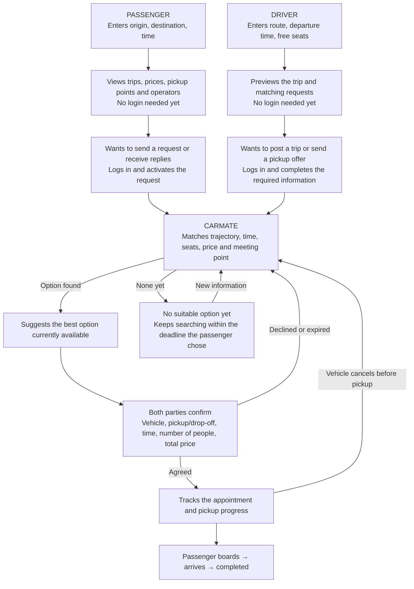

# CarMate flow — final version

**CarMate helps passengers find a suitable vehicle, lets both parties lock in a clear appointment, tracks the pickup, and finds the next option when something goes wrong.**

At this stage:

- **Posting trips, searching for vehicles and connecting are free.**
- The driver lists a price or leaves “Liên hệ” (Contact); the total price must be clear before confirmation.
- The passenger pays the driver directly.
- Pickup is at a virtual station, door-to-door, or another meeting point, depending on the option both parties accept.

This is the **target business flow**; it does not mean everything has already been implemented in the app. Section [9](#9-implementation-status) checks each part against the source code.

This document is the product picture. The technical behavior contract of the connection flow is in [CONNECTION_FLOW.md](CONNECTION_FLOW.md); operator profiles and management rights are in [OPERATOR_PROFILES.md](OPERATOR_PROFILES.md).

## 1. Overall picture

**CarMate compiles and ranks automatically. The two parties decide whether to accept the proposed appointment.**

---

## 2. Passenger flow: from “I need a ride” to having an appointment

### Step 1 — Start using it immediately

The passenger opens the link or website on their phone, with no need to install an app or log in yet.

Enter:

- **Where I am → where I want to go.**
- When they want to leave, and how long they can wait.
- Number of people.

Additional options appear when needed: the time they must arrive by, the desired price, door-to-door pickup or whether they can walk to a nearby point.

### Step 2 — See concrete options

CarMate displays:

| What the passenger needs to know | What must be shown |
|---|---|
| Which vehicle fits? | Operator/driver, vehicle type, route |
| Where is the pickup? | Door-to-door or a suggested meeting point |
| When is pickup, when is arrival? | Expected time window and the last update |
| What is the total price? | Price for the selected request, surcharges if any |
| Is it trustworthy? | Verified information and evidence-backed history |
| Why was it suggested? | For example: arrives by the required time, less walking, suitable price |

A “Liên hệ” price must be shown as **total price unknown**, and must not be treated as the cheapest.

**This search is still private.** CarMate does not yet turn the person browsing into a “waiting passenger” to pitch to drivers.

### Step 3 — The passenger chooses how to continue

There are three directions:

**A. “Request pickup on this trip”**

The passenger has seen a suitable vehicle and wants to send a request.

**B. “Find a suitable vehicle and notify me”**

The passenger wants CarMate to keep their request active, look for vehicles and receive offers from suitable drivers.

**C. Call/Zalo directly**

The passenger makes contact through the details the driver has made public, and is not forced to log in to get the number.

### Step 4 — Log in when activating A or B

Explanation:

> **Log in to save your request, receive replies and track your appointments.**

After login:

- Keep the origin, destination and time already entered.
- There is a usable communication channel.
- Tell the passenger which information will be shared with matching vehicles.
- The request has a clear deadline; the passenger can edit or stop it.

**Reason the passenger logs in:** from here, CarMate can keep processing a request that belongs to them, even after they close the screen.

### Step 5 — Confirm the appointment

When there is an option both parties agree on, the passenger sees:

**Who picks up — which vehicle — where — in what time window — drop-off where — how many people — what total price.**

If the deal is made by phone/Zalo, the two parties can record those conditions again on CarMate.

**“Contacted” and “Pickup confirmed” must be two separate statuses.**

---

## 3. Driver flow: from “I have a trip” to picking up passengers

### Step 1 — See the value first

The driver goes to the section:

**“Find passengers along my route.”**

Enter the route, date/time and free seats. No login needed yet.

CarMate shows:

- The trip page being created.
- Real matching requests, if any.
- Pickup/drop-off areas, number of people and time windows.
- The expected impact on the journey.

The preview protects the passenger's identity and private address.

### Step 2 — Log in when they want to use the results

The two main activation buttons:

- **“Post a trip and receive requests”.**
- **“Send an offer to pick up this passenger”.**

Explanation:

> **Log in to manage your trip, receive replies and arrange passenger pickup appointments.**

After login, continue with the exact task in progress.

### Step 3 — Complete the required information

The driver sets up:

- The responsible person/entity and the chauffeur who performs the trip.
- The vehicle, number of seats and contact information.
- Listed price or “Liên hệ”.
- Detour limit, waiting time, pickup method.
- Verification information appropriate to the activity being taken part in.

**A Google/Telegram account establishes account management rights; the quality and eligibility of the vehicle must be checked separately.**

### Step 4 — Receive suggestions already filtered by CarMate

Instead of reading every request, the driver sees information that supports a decision:

> There is a suitable passenger at a point ahead.
> How many seats are needed, where they are going, and the time window for pickup.
> How an additional pickup affects the appointments already accepted.

The driver accepts or proposes an adjustment. Once the passenger agrees to the final conditions, the appointment takes effect.

### Step 5 — Keep picking up passengers along the journey

CarMate keeps considering passengers at points ahead, based on the **free seats on each segment**.

Example, a vehicle with four seats:

- Two passengers go A → D.
- Two passengers go B → C.
- After C, it can take two passengers C → D if the timing works.

The driver must also update passengers taken outside CarMate so the system does not suggest more than the number of seats.

**Reason the driver comes back:** the passenger list, remaining seats and the pickup/drop-off order stay useful while the vehicle is running.

---

## 4. How does CarMate arrange things as the intermediary?

CarMate considers all of the following at once:

1. **Right direction:** the vehicle can pass through the pickup point and bring the passenger to the destination.
2. **Right time:** the two time windows overlap.
3. **Enough seats:** across the whole segment the passenger will travel.
4. **Feasible meeting point:** reachable, pickup is possible and both parties accept it.
5. **Suitable price:** compute the total price for the journey.
6. **Level of certainty:** based on fresh data and real-world evidence.
7. **Keep earlier commitments:** an additional pickup does not break appointments that are already confirmed.

### What does “the best” mean, as finalized?

**The most suitable option found at present, within the vehicle supply and data available, according to the passenger's needs and the driver's limits.**

A passenger who prioritizes arriving early may receive a different suggestion from one who prioritizes a low price.

Once both parties confirm, CarMate protects that appointment. The system does not swap vehicles or passengers just because a more attractive option appears.

---

## 5. After confirmation: why both keep using CarMate

Both parties look at the same appointment:

| The passenger sees | The driver (owner/chauffeur) sees |
|---|---|
| Vehicle confirmed, on the way or running late | The next pickup/drop-off points |
| The confirmed meeting point and pickup time window | Which passengers are ready |
| The latest expected arrival time | Number of people and seats left on each segment |
| What to do next | Changes that need a response |
| How to make contact, report a problem, find a replacement | The chance to take on additional suitable passengers |

The main statuses:

**Searching → Awaiting response → Confirmed → Vehicle on the way → Boarded → Completed.**

If an update is missing, it must show **“Chưa có cập nhật mới”** (“No new updates yet”). A changed expected time must not silently replace the agreed time window.

Logging in makes it possible to save and receive updates; the user needs to choose a working notification channel.

---

## 6. When there is a cancellation, delay or a missed meeting

| Situation | How CarMate handles it |
|---|---|
| **Vehicle cancels before pickup** | Keep the original request, the time already waited and the arrival deadline; look for a feasible replacement option |
| **Another operator can take over** | Send a takeover offer; the passenger is told the new vehicle, time and price; both parties confirm before the transfer |
| **Vehicle is late** | Warn, update the expected time; the passenger chooses to keep waiting or look for a replacement |
| **Passenger no longer travels** | Close the request, stop searching/contacting, notify the vehicle and release the seat |
| **Passenger still travels but wants a change** | Handle the change in a controlled way, making clear which appointment is still valid |
| **Passenger cancels, vehicle still runs** | Find another passenger that fits the part of the journey and the seat that just became free |
| **No replacement vehicle** | State the situation clearly, keep searching until the deadline the passenger chose |
| **Incident after the passenger has boarded** | Switch to journey support from the current position; coordinate a handover if an option exists |

A suitable operator can reach out proactively **within the scope the passenger allows**. CarMate manages offers so the passenger is not called by many vehicles at once.

> **Not yet implemented.** Currently `batchMatchingEngine` writes the whole list of rescue candidates at once, together with the contact number of each driver who has agreed to publish. There is no queue or limit on the number of concurrent offers, so a passenger whose trip was cancelled may receive many calls in a row. This needs to be added before opening to real users.

### The value of “x lost”

When an appointment falls through, the waiting time and the opportunity that have already passed must be recorded. **Do not reset the passenger's clock to zero.**

CarMate optimizes the next option within the remaining time. The later trip's price or time may still be better in one respect; the system does not try to make the later option worse.

**The fallback option is the ability to search and re-confirm, not a vehicle that is already certainly set aside.**

---

## 7. Finalizing the reason to log in for each party

| | Passenger | Driver (owner/chauffeur) |
|---|---|---|
| **Value seen first** | Trips, prices, pickup points, operator information | The trip page and real matching requests |
| **When they log in** | Sending a pickup request, activating the vehicle search or saving an appointment | Posting a trip or sending a pickup offer |
| **Benefit right after login** | The request is saved, with replies and a clear status | The trip is managed, with requests and replies received |
| **Reason to come back during the trip** | Track the vehicle, pickup time and handle incidents | Manage passengers, seats and the pickup/drop-off order |
| **Reason to use it next time** | Finding and managing the next journey is more convenient | Re-post the trip, keep finding suitable passengers |

Use Google/Telegram to reduce steps, keep the information already entered and return to the exact action in progress. Viewing public information and calling directly remain open.

**After both parties have each other's phone number, CarMate still has value by managing an appointment that keeps changing over time.**

## 8. Conditions for this flow to gain traction at launch

If there are no matching requests yet:

- The driver can still create a trip page to use with existing customers.
- The passenger can save a request and receive replies when a suitable vehicle appears.
- Show the true situation; views must not be counted as waiting passengers.

We need to verify that **the trip page reduces the effort of making contact** and that **trip matching produces real appointments**. Being free and easy login support both, but are not enough to guarantee that users come on their own.

### The operator directory is the first content source

Before both sides are present, a source-checked operator directory is something usable immediately: passengers look up and call directly, without waiting for network effects. If a passenger sees something wrong, they can **suggest a correction** right on the profile; admin approves with one tap and the number is updated, with a history of who suggested it and what was changed. When an operator claims management of the profile, they re-check it themselves and are responsible for their own information.

Details of the mechanism are in [OPERATOR_PROFILES.md](OPERATOR_PROFILES.md).

### Product closing statement

**Passengers log in so CarMate keeps following their request and appointment. Drivers log in so CarMate helps find suitable passengers and arrange the pickup. Both stay because the journey still needs to be tracked until they meet and finish the ride.**

---

## 9. Implementation status

Checks the document against the source code at the time of writing. A “not yet” item is not a bug — the document describes the target flow.

| Item | Status | Where to verify |
|---|---|---|
| View/search without login | Yes | `GET /operators`, `/trips`, `/intents` do not have `requireAuth` attached |
| “Contacted” ≠ “Pickup confirmed” | Yes | `inquiring` → `pre_confirmed` → `confirmed` |
| Confirm the exact proposal version | Yes | `proposalVersion` in `confirmAppointment` |
| Free seats per segment | Yes | `peakSeats(reservations, segment, tripSegment)` |
| Boarding and completion are two separate records | Yes | `markAppointmentBoarded`, `completeAppointment` |
| Preserve the time already waited when the vehicle cancels | Yes | `waitingElapsedMs` computed from `originalRequestedAt` |
| “Why it was suggested” | Yes | `reason` in `connectionMatching` |
| Validity period of the data | Yes | `freshness()` → `fresh`/`stale`/`unreviewed`, `priceStale` |
| Suggest a correction to operator information | Yes | `POST /operators/:id/reports` with type `correction` |
| “Vehicle on the way” as a main status | Partial | Has the `driver_confirmed` flag and `readyConfirmedAt`; not yet part of the main status set |
| Label “Chưa có cập nhật mới” (“No new updates yet”) | Not yet | String not found in `apps/web/src` |
| Throttling of concurrent offers | Not yet | See the note in section 6 |
