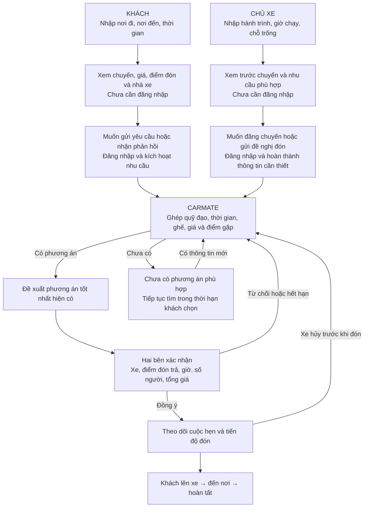

# Luồng CarMate — bản chốt

**CarMate giúp khách tìm được xe phù hợp, hai bên chốt một cuộc hẹn rõ ràng, theo dõi việc đón và tìm phương án tiếp theo khi có sự cố.**

Giai đoạn này:

- **Miễn phí đăng chuyến, tìm xe và kết nối.**
- Chủ xe niêm yết giá hoặc để “Liên hệ”; tổng tiền phải rõ trước khi xác nhận.
- Khách trả tiền trực tiếp cho chủ xe.
- Đón tại trạm ảo, tận nơi hoặc điểm gặp khác tùy phương án hai bên chấp nhận.

Đây là **luồng nghiệp vụ mục tiêu**, chưa có nghĩa toàn bộ đã được triển khai trong app. Mục [9](#9-trạng-thái-triển-khai) đối chiếu từng phần với mã nguồn.

Tài liệu này là bức tranh sản phẩm. Hợp đồng hành vi kỹ thuật của luồng kết nối nằm ở [CONNECTION_FLOW.md](CONNECTION_FLOW.md); hồ sơ nhà xe và quyền quản lý ở [OPERATOR_PROFILES.md](OPERATOR_PROFILES.md).

## 1. Bức tranh tổng thể

**CarMate tự tổng hợp và sắp xếp. Hai bên quyết định có chấp nhận cuộc hẹn được đề xuất hay không.**

---

## 2. Luồng của khách: từ “tôi cần đi xe” đến có cuộc hẹn

### Bước 1 — Vào dùng ngay

Khách mở đường dẫn hoặc website trên điện thoại, chưa cần cài app hay đăng nhập.

Nhập:

- **Tôi đang ở đâu → muốn đến đâu.**
- Muốn đi lúc nào, chờ được đến khi nào.
- Số người.

Các lựa chọn bổ sung xuất hiện khi cần: giờ phải đến nơi, mức giá mong muốn, đón tận nơi hay có thể ra điểm gần đó.

### Bước 2 — Nhìn thấy phương án cụ thể

CarMate hiển thị:

| Khách cần biết | Nội dung phải có |
|---|---|
| Xe nào phù hợp? | Nhà xe/chủ xe, loại xe, hành trình |
| Đón ở đâu? | Tận nơi hoặc điểm gặp được đề xuất |
| Khi nào đón, khi nào đến? | Khoảng thời gian dự kiến và lần cập nhật |
| Tổng tiền bao nhiêu? | Giá cho nhu cầu đang chọn, phụ phí nếu có |
| Có đáng tin không? | Thông tin đã xác minh và lịch sử có bằng chứng |
| Vì sao được đề xuất? | Ví dụ: đúng giờ cần đến, ít đi bộ, giá phù hợp |

Giá “Liên hệ” phải hiện là **chưa biết tổng giá**, không được tự xem là rẻ nhất.

**Lượt tìm kiếm này vẫn là riêng tư.** CarMate chưa biến người đang xem thành “khách đang chờ” để chào cho tài xế.

### Bước 3 — Khách chọn cách tiếp tục

Có ba hướng:

**A. “Yêu cầu đón chuyến này”**

Khách đã thấy xe phù hợp và muốn gửi yêu cầu.

**B. “Tìm xe phù hợp và báo tôi”**

Khách muốn CarMate duy trì nhu cầu, tìm xe và nhận đề nghị từ các chủ xe phù hợp.

**C. Gọi điện/Zalo trực tiếp**

Khách được liên hệ qua thông tin chủ xe đã công khai, không bị buộc đăng nhập để lấy số.

### Bước 4 — Đăng nhập khi kích hoạt A hoặc B

Lời giải thích:

> **Đăng nhập để lưu nhu cầu, nhận phản hồi và theo dõi cuộc hẹn của bạn.**

Sau đăng nhập:

- Giữ nguyên nơi đi, nơi đến và thời gian đã nhập.
- Có kênh liên lạc dùng được.
- Cho khách biết thông tin nào sẽ được chia sẻ với xe phù hợp.
- Nhu cầu có thời hạn rõ ràng; khách sửa hoặc dừng được.

**Lý do khách đăng nhập:** từ đây, CarMate có thể tiếp tục xử lý một nhu cầu thuộc về họ, kể cả khi họ đóng màn hình.

### Bước 5 — Xác nhận cuộc hẹn

Khi có phương án được hai bên đồng ý, khách nhìn thấy:

**Ai đón — xe nào — đón ở đâu — trong khoảng giờ nào — trả ở đâu — bao nhiêu người — tổng tiền bao nhiêu.**

Nếu chốt qua điện thoại/Zalo, hai bên có thể ghi nhận lại các điều kiện đó trên CarMate.

**“Đã liên hệ” và “Đã xác nhận đón” phải là hai trạng thái riêng.**

---

## 3. Luồng của chủ xe: từ “tôi có chuyến” đến nhận khách

### Bước 1 — Xem giá trị trước

Chủ xe vào mục:

**“Tìm khách trên đường tôi chạy.”**

Nhập hành trình, ngày giờ, số chỗ trống. Chưa cần đăng nhập.

CarMate cho xem:

- Trang chuyến đang tạo.
- Các nhu cầu thật phù hợp, nếu có.
- Khu vực đón/trả, số người và cửa sổ thời gian.
- Mức ảnh hưởng dự kiến đến hành trình.

Thông tin xem trước bảo vệ danh tính và địa chỉ riêng của khách.

### Bước 2 — Đăng nhập khi muốn dùng kết quả

Hai nút kích hoạt chính:

- **“Đăng chuyến và nhận yêu cầu”.**
- **“Gửi đề nghị đón khách này”.**

Lời giải thích:

> **Đăng nhập để quản lý chuyến, nhận phản hồi và sắp xếp các cuộc hẹn đón khách.**

Sau đăng nhập, tiếp tục đúng công việc đang làm.

### Bước 3 — Hoàn thành thông tin cần thiết

Chủ xe thiết lập:

- Người/đơn vị chịu trách nhiệm và tài xế thực hiện.
- Xe, số chỗ và thông tin liên lạc.
- Giá niêm yết hoặc “Liên hệ”.
- Giới hạn đi vòng, thời gian chờ, cách đón.
- Thông tin xác minh phù hợp với hoạt động tham gia.

**Tài khoản Google/Telegram xác lập quyền quản lý tài khoản; chất lượng và điều kiện tham gia của xe cần được kiểm tra riêng.**

### Bước 4 — Nhận đề xuất đã được CarMate lọc

Thay vì phải đọc mọi yêu cầu, chủ xe thấy thông tin phục vụ quyết định:

> Có khách phù hợp ở điểm phía trước.
> Cần bao nhiêu ghế, đi đến đâu, đón trong khoảng giờ nào.
> Đón thêm ảnh hưởng thế nào đến những cuộc hẹn đã nhận.

Chủ xe chấp nhận hoặc đề xuất điều chỉnh. Khách đồng ý các điều kiện cuối cùng thì cuộc hẹn có hiệu lực.

### Bước 5 — Tiếp tục nhận khách trên hành trình

CarMate tiếp tục xét khách ở những điểm phía trước, dựa trên **ghế còn trống ở từng đoạn**.

Ví dụ xe có bốn chỗ:

- Hai khách đi A → D.
- Hai khách đi B → C.
- Sau C, có thể nhận hai khách C → D nếu đáp ứng thời gian.

Chủ xe cũng phải cập nhật khách nhận ngoài CarMate để hệ thống không đề xuất quá số ghế.

**Lý do chủ xe quay lại:** danh sách khách, ghế còn lại và thứ tự đón/trả tiếp tục hữu ích khi xe đang chạy.

---

## 4. CarMate đứng giữa sắp xếp như thế nào?

CarMate xét đồng thời:

1. **Đúng hướng:** xe có thể đi qua điểm đón và đưa khách đến đích.
2. **Đúng thời gian:** hai cửa sổ thời gian giao nhau.
3. **Đủ ghế:** trên toàn bộ đoạn khách sẽ đi.
4. **Điểm gặp khả thi:** tiếp cận được, có thể đón và hai bên chấp nhận.
5. **Giá phù hợp:** tính tổng tiền cho hành trình.
6. **Mức chắc chắn:** dựa trên dữ liệu còn mới và bằng chứng thực tế.
7. **Giữ cam kết cũ:** việc đón thêm không phá các cuộc hẹn đã xác nhận.

### “The best” được chốt nghĩa là gì?

**Phương án phù hợp nhất hiện tìm được, trong nguồn xe và dữ liệu đang có, theo nhu cầu của khách và giới hạn của chủ xe.**

Khách ưu tiên đến sớm có thể nhận đề xuất khác khách ưu tiên giá thấp.

Sau khi hai bên xác nhận, CarMate bảo vệ cuộc hẹn ấy. Hệ thống không tự đổi xe hoặc đổi khách chỉ vì xuất hiện một lựa chọn mới hấp dẫn hơn.

---

## 5. Sau khi chốt: lý do cả hai tiếp tục dùng CarMate

Hai bên cùng nhìn một cuộc hẹn:

| Khách nhìn thấy | Chủ xe/tài xế nhìn thấy |
|---|---|
| Xe đã xác nhận, đang đến hay đang trễ | Các điểm cần đón/trả tiếp theo |
| Điểm gặp và khoảng giờ đón đã chốt | Khách nào đã sẵn sàng |
| Thời gian đến dự kiến mới nhất | Số người và ghế còn lại từng đoạn |
| Cần làm gì tiếp theo | Thay đổi cần phản hồi |
| Cách liên hệ, báo vấn đề, tìm thay thế | Cơ hội nhận thêm khách phù hợp |

Các trạng thái chính:

**Đang tìm → Chờ phản hồi → Đã xác nhận → Xe đang đến → Đã lên xe → Hoàn tất.**

Nếu thiếu cập nhật, phải hiện **“Chưa có cập nhật mới”**. Thời gian dự kiến thay đổi không được âm thầm thay thế khoảng giờ đã hẹn.

Đăng nhập tạo điều kiện lưu và nhận cập nhật; người dùng cần chọn một kênh thông báo hoạt động được.

---

## 6. Khi có hủy, trễ hoặc không gặp được nhau

| Tình huống | CarMate xử lý |
|---|---|
| **Xe hủy trước khi đón** | Giữ nhu cầu gốc, thời gian đã chờ và hạn đến; tìm phương án thay thế còn khả thi |
| **Nhà xe khác có thể nhận** | Gửi đề nghị tiếp nhận; khách được biết xe, giờ và giá mới; hai bên xác nhận trước khi chuyển |
| **Xe trễ** | Cảnh báo, cập nhật dự kiến; khách chọn tiếp tục chờ hoặc tìm thay thế |
| **Khách không đi nữa** | Đóng nhu cầu, dừng tìm kiếm/liên hệ, báo xe và giải phóng ghế |
| **Khách vẫn đi nhưng muốn đổi** | Xử lý thay đổi có kiểm soát, làm rõ cuộc hẹn nào còn hiệu lực |
| **Khách hủy, xe vẫn chạy** | Tìm khách khác phù hợp với phần hành trình và ghế vừa trống |
| **Không có xe thay thế** | Nói rõ tình trạng, tiếp tục tìm đến thời hạn khách chọn |
| **Sự cố khi khách đã lên xe** | Chuyển sang hỗ trợ hành trình từ vị trí hiện tại; phối hợp tiếp nhận nếu có phương án |

Nhà xe phù hợp có thể chủ động liên hệ **trong phạm vi khách cho phép**. CarMate quản lý đề nghị để khách không bị hàng loạt xe gọi cùng lúc.

> **Chưa triển khai.** Hiện `batchMatchingEngine` ghi cả danh sách ứng viên cứu hộ cùng lúc, kèm số liên hệ của từng chủ xe đã đồng ý công khai. Chưa có hàng đợi hay giới hạn số đề nghị đồng thời, nên một khách bị hủy chuyến có thể nhận nhiều cuộc gọi liên tiếp. Cần bổ sung trước khi mở cho người dùng thật.

### Giá trị “x bị mất”

Khi cuộc hẹn hỏng, thời gian chờ và cơ hội đã trôi qua cần được ghi nhận. **Không đặt lại đồng hồ của khách từ đầu.**

CarMate tối ưu phương án tiếp theo trong thời gian còn lại. Giá hoặc thời gian của chuyến sau vẫn có thể tốt hơn ở một mặt; hệ thống không cố làm phương án sau tệ đi.

**Phương án dự phòng là khả năng tìm và xác nhận lại, chưa phải một chiếc xe đã chắc chắn dành sẵn.**

---

## 7. Chốt lý do đăng nhập cho từng bên

| | Khách | Chủ xe/tài xế |
|---|---|---|
| **Giá trị nhìn thấy trước** | Chuyến, giá, điểm đón, thông tin nhà xe | Trang chuyến và nhu cầu thật phù hợp |
| **Thời điểm đăng nhập** | Gửi yêu cầu đón, kích hoạt tìm xe hoặc lưu cuộc hẹn | Đăng chuyến hoặc gửi đề nghị đón |
| **Lợi ích ngay sau đăng nhập** | Nhu cầu được lưu, có phản hồi và trạng thái rõ ràng | Chuyến được quản lý, nhận yêu cầu và phản hồi |
| **Lý do quay lại trong chuyến** | Theo dõi xe, giờ đón và xử lý sự cố | Quản lý khách, ghế và thứ tự đón/trả |
| **Lý do dùng lần sau** | Tìm và quản lý hành trình tiếp theo thuận tiện hơn | Đăng lại chuyến, tiếp tục tìm khách phù hợp |

Dùng Google/Telegram để giảm thao tác, giữ thông tin đã nhập và quay về đúng hành động đang làm. Việc xem thông tin công khai và gọi trực tiếp vẫn mở.

**Sau khi hai bên có số điện thoại, CarMate vẫn có giá trị nhờ quản lý cuộc hẹn đang thay đổi theo thời gian.**

## 8. Điều kiện để luồng này có sức hút khi mới ra mắt

Nếu chưa có nhu cầu phù hợp:

- Chủ xe vẫn có thể tạo trang chuyến dùng với khách hiện hữu.
- Khách có thể lưu nhu cầu và nhận phản hồi khi xuất hiện xe phù hợp.
- Hiển thị đúng tình trạng; lượt xem không được tính thành khách đang chờ.

Cần kiểm chứng việc **trang chuyến giúp bớt công liên hệ** và **ghép chuyến tạo được cuộc hẹn thật**. Miễn phí và đăng nhập dễ hỗ trợ hai việc đó, nhưng chưa đủ bảo đảm người dùng tự tìm đến.

### Danh bạ nhà xe là nguồn nội dung đầu tiên

Trước khi có đủ hai phía, danh bạ nhà xe đã kiểm nguồn là thứ dùng được ngay: khách tra cứu và gọi thẳng, không cần chờ hiệu ứng mạng. Khách xem thấy sai thì **đề xuất sửa** ngay trên hồ sơ; quản trị duyệt một chạm là số được cập nhật, kèm lịch sử ai đề xuất và đã đổi gì. Khi nhà xe nhận quyền quản lý hồ sơ, họ tự kiểm lại và chịu trách nhiệm cho thông tin của mình.

Chi tiết cơ chế tại [OPERATOR_PROFILES.md](OPERATOR_PROFILES.md).

### Câu chốt sản phẩm

**Khách đăng nhập để CarMate tiếp tục theo nhu cầu và cuộc hẹn của mình. Chủ xe đăng nhập để CarMate giúp tìm khách phù hợp và sắp xếp việc đón. Cả hai ở lại vì hành trình vẫn cần được theo dõi cho đến khi gặp nhau và đi xong.**

---

## 9. Trạng thái triển khai

Đối chiếu tài liệu với mã nguồn tại thời điểm viết. Phần “chưa có” không phải lỗi — tài liệu mô tả luồng mục tiêu.

| Phần | Trạng thái | Nơi kiểm chứng |
|---|---|---|
| Xem/tìm không cần đăng nhập | Có | `GET /operators`, `/trips`, `/intents` không gắn `requireAuth` |
| “Đã liên hệ” ≠ “Đã xác nhận đón” | Có | `inquiring` → `pre_confirmed` → `confirmed` |
| Chốt đúng phiên bản đề nghị | Có | `proposalVersion` trong `confirmAppointment` |
| Ghế còn trống theo từng đoạn | Có | `peakSeats(reservations, segment, tripSegment)` |
| Lên xe và hoàn tất là hai lần ghi nhận | Có | `markAppointmentBoarded`, `completeAppointment` |
| Giữ thời gian đã chờ khi xe hủy | Có | `waitingElapsedMs` tính từ `originalRequestedAt` |
| “Vì sao được đề xuất” | Có | `reason` trong `connectionMatching` |
| Thời hạn hiệu lực của dữ liệu | Có | `freshness()` → `fresh`/`stale`/`unreviewed`, `priceStale` |
| Đề xuất sửa thông tin nhà xe | Có | `POST /operators/:id/reports` loại `correction` |
| “Xe đang đến” là trạng thái chính | Một phần | Có cờ `driver_confirmed`, `readyConfirmedAt`; chưa nằm trong tập trạng thái chính |
| Nhãn “Chưa có cập nhật mới” | Chưa có | Không tìm thấy chuỗi trong `apps/web/src` |
| Điều tiết số đề nghị đồng thời | Chưa có | Xem ghi chú ở mục 6 |
